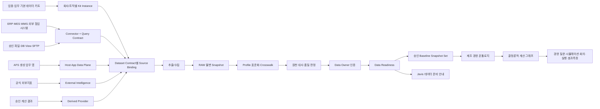

# AI Factory Studio 데이터 연결·준비 런타임 상세설계

> 문서 ID: `BDR-DESIGN-01`  
> 영문 기술명: Business Data Binding Runtime  
> 사용자 화면명: 데이터 연결·준비  
> 기준일: 2026-08-15  
> 작성: Codex  
> 상태: 구현 기준 상세설계 1.0 · **§6(BDR-1)은 구현 완료 · §7 이후 BDR-2~7 미구현**  
> ⚠️ 2026-08-15 갱신: §6 「I-4 App Runtime Contract 즉시 보강」은 I-4 2.2/2.2a 로 들어갔다. 그 아래 논리 데이터 모델·파이프라인은 아직 코드가 없다.  
> 적용 관문: G2-B 데이터 키트 · G2-D Minimum Viable Actual · G3 App Factory · G4 경영 디지털트윈  
> 기계 계약: `business_data_binding_contract_v1.schema.json`  
> 구현 인계: `docs/handoff/BUSINESS_DATA_BINDING_RUNTIME_TEAM_HANDOFF_2026-08-15.md`

---

## 0. 이 설계가 해결하는 제품 위험

AI Factory Studio의 차별점은 현업이 만든 앱의 운영 데이터와 기존 회사 데이터, 외부지표를 연결해 실제 경영 시뮬레이션과 의사결정에 사용하는 것이다. 그러나 이 구조는 다음 두 극단으로 실패할 수 있다.

1. 현업이 앱을 충분히 사용하지 않거나 양질의 데이터를 만들지 못하면 경영 결과가 비어 버린다.
2. 이를 막겠다고 ERP·MES·WMS·LPL류 시스템을 모두 EAI로 연결하면 초기 비용과 유지비가 커지고, 기존 시스템 위에 BI 성격의 옥상옥을 하나 더 얹게 된다.

이 설계는 두 극단을 모두 피한다.

> **기존에 존재하는 값은 다시 입력하지 않고, 경영 판단에 꼭 필요한 최소 데이터만 단계적으로 연결하며, 원천에 없는 결손만 AFS 업무 앱이 보완한다. 모든 공식 계산은 승인된 스냅샷과 명시된 가정으로 재현한다.**

### 0.1 제품 성공 조건

- 사용자는 빈 화면에서 시작하지 않고 업종·업무별 기본 데이터 키트를 선택한다.
- 키트는 필요한 데이터, 이유, 최소 품질, 권장 원천, 대체 파일 양식, 결손 보완 업무를 먼저 제안한다.
- 같은 사실을 기존 시스템과 AFS에 이중 입력하지 않는다.
- 실시간 I/F가 없어도 승인 파일 스냅샷으로 첫 효용을 증명할 수 있다.
- 데이터 원천이 늘어도 앱마다 I/F를 새로 만들지 않고, 등록된 원천 계약을 여러 앱과 계산이 재사용한다.
- 현업 앱 사용률이 낮아도 기존 Actual·승인 파일·외부지표로 최소 경영 기준선은 유지한다.
- 데이터 부족은 0이나 정상으로 위장하지 않고, 사용 가능한 기능과 막힌 결과, 다음 행동을 구분해 보여 준다.

### 0.2 하지 않는 것

- 전사 ERP 데이터 전체 복제
- 앱별 직접 DB/API/MCP 연결
- 원천이 있는데 같은 값을 받는 AFS 입력 화면 생성
- 승인되지 않은 합성값을 Actual로 승격
- 실시간 조회 결과를 스냅샷 없이 공식 경영 계산에 직접 사용
- 외부 참여자에게 AI Factory Studio 접근 권한 부여
- LLM이 데이터 원천·품질·승격 여부를 최종 확정
- 첫 도입부터 양방향 EAI/CDC/write-back 강제

---

## 1. 정본 계층과 기존 자산 재사용

본 문서는 Product Bible·제품 전략·최종 로드맵·`PROGRESS.md`의 하위 설계다. 충돌 시 상위 문서가 우선한다.

### 1.1 새로 만들지 않는 것

| 기존 자산 | 현재 책임 | 본 설계에서의 사용 |
|---|---|---|
| `core/connector_registry.py` | Connector와 Query Contract 등록 | 기존 시스템·파일·MCP·API 원천 등록과 조회 계약 정본 |
| `core/connector_execution.py` | 요청·응답 계약 강제, 감사, 어댑터 실행 | `CONNECTOR_QUERY` 추출의 유일한 실행 경로 |
| `core/master_data.py:data_assets` | 자산 위치·스키마·소유자·민감도 | 결속된 원천과 스냅샷의 카탈로그 등록 |
| `core/master_data.py:data_contracts` | 생산자–소비자 데이터 약속 | 키트 계약을 회사·조직에 물질화한 운영 계약 |
| MDM·Crosswalk·용어사전 | 표준 개체·코드·표현 대응 | 원천 필드와 표준 의미·마스터를 연결 |
| `core/app_data.py` | AFS 생성 앱의 데이터 평면 | 원천에 없는 보완 입력과 AFS 고유 운영 데이터 |
| `core/external_intelligence.py` | 외부 원천·지표·관측·전망 | 검증 외부지표와 전망의 정본 |
| `core/enterprise_context/scenario_inputs.py` | 계산 기준선과 시나리오 결과 | 준비 완료 스냅샷을 집계한 계산 입력 기준선 |
| G2 제조 경영 온톨로지 | 의미 관계·근거 경로 | 준비된 데이터가 어느 업무·KPI·재무 영향에 쓰이는지 연결 |
| G4 계산 그래프 | 결정론적 수치 계산 | 고정된 스냅샷 ID와 가정만 입력으로 사용 |

### 1.2 새로 필요한 최소 런타임

1. **Kit Instance**: 제품 기본 데이터 키트를 특정 회사·사업부·공장 문맥에 적용한 인스턴스
2. **Source Binding**: 키트의 데이터 계약을 실제 원천 또는 AFS 보완 입력에 결속
3. **Dataset Snapshot**: 원천에서 추출·검증·대사·승인한 불변 데이터 판
4. **Data Readiness**: 데이터별 사용 가능 여부, 막힌 경영 결과, 다음 행동을 결정론적으로 판정
5. **Baseline Build**: 준비 완료 스냅샷 집합을 G4 기준선으로 물질화

원천 데이터 본문을 신규 SQLite에 전부 복제하지 않는다. 신규 저장소에는 계약·결속·상태·지문·승인·저장 위치 참조만 보관한다.

---

## 2. 전체 To-Be 구조



### 2.1 핵심 분리

| 계층 | 답하는 질문 | 하지 않는 일 |
|---|---|---|
| 데이터 키트 | 무엇이 왜 필요한가 | 실제 원천을 임의 확정하지 않음 |
| Source Binding | 그 데이터는 어디서 오며 누가 책임지는가 | 값을 계산하지 않음 |
| Snapshot | 어떤 시점의 어떤 판을 사용했는가 | 의미 관계를 추론하지 않음 |
| Readiness | 지금 어떤 결과까지 믿고 만들 수 있는가 | 부족한 값을 0으로 채우지 않음 |
| 온톨로지 | 무엇이 무엇에 왜 영향을 주는가 | 수치를 임의 계산하지 않음 |
| 계산 그래프 | 승인 입력과 산식으로 영향이 얼마인가 | 원천의 품질·승인을 대신하지 않음 |
| LLM/Javis | 이해·탐색·설명·다음 행동 제안 | Actual·승인·경영 숫자를 확정하지 않음 |

---

## 3. 사용자·기술 용어

| 사용자 용어 | 기술 용어 | 정의 |
|---|---|---|
| 기본 데이터 키트 | Data Kit Template | 업종·업무별 필요 데이터·품질·원천 후보·계산·업무 템플릿 |
| 회사 데이터 준비 | Kit Instance | 키트를 회사·조직 문맥에 적용한 작업 단위 |
| 데이터 연결 | Source Binding | 데이터 계약과 실제 원천의 승인된 결속 |
| 데이터 판 | Dataset Snapshot | 특정 기준시점의 불변 추출 결과 |
| 데이터 준비 상태 | Data Readiness | 기능·계산·보고서별 사용 가능성과 차단 사유 |
| 공식 기준선 | Certified Baseline | 승인 스냅샷 집합과 지문으로 고정된 계산 입력 |
| 보완 입력 | AFS Native Supplement | 원천에 없는 결손을 AFS 앱에서 책임 있게 입력한 값 |
| 대사 | Reconciliation | 원천 총계·건수·통제 합계와 준비 데이터의 일치 검증 |

화면에는 `binding_id`, `provider_type`, `query_contract_id` 같은 내부 식별자를 기본 노출하지 않는다. 상세 감사·관리자 화면에서만 표시한다.

---

## 4. 데이터 출처 모드와 통합 수준

### 4.1 출처 모드

| `provider_type` | 사용자 표현 | 책임 | 쓰기 |
|---|---|---|---|
| `CONNECTOR_QUERY` | 기존 시스템 연결 | 승인 Connector/Query Contract 조회 | 읽기 전용 |
| `FILE_SNAPSHOT` | 검증 파일 불러오기 | 지정 양식·SFTP·DB View 결과를 불변 판으로 수집 | 읽기 전용 |
| `AFS_NATIVE` | AFS에서 보완 입력 | 기존 원천에 없는 업무 사건·보완값 | Host Runtime 허용 범위만 |
| `DERIVED` | 계산된 데이터 | 승인 산식·변환·집계 결과 | 원천 직접 수정 금지 |
| `EXTERNAL_REFERENCE` | 외부 기준정보 | 공식·검증 외부 관측·전망 | 읽기 전용 |

### 4.2 데이터 역할

| `authoritative_role` | 의미 | 공식 실적 사용 |
|---|---|---|
| `ACTUAL` | 실제 발생·확정 데이터 | `CERTIFIED`일 때만 가능 |
| `PLAN` | 승인 계획 | 승인 판만 가능 |
| `FORECAST` | 기관·모델 전망 | Actual로 승격 불가 |
| `SUPPLEMENT` | 원천 결손 보완 | 오너 승인과 대사 후 제한 사용 |
| `SCENARIO` | 사용자가 바꾼 가정 | Actual 변경 금지 |
| `REFERENCE` | 설명·비교용 기준 | 직접 회계 실적 처리 금지 |
| `DERIVED_RESULT` | 결정론적 계산 결과 | 입력·산식·버전과 함께 사용 |

### 4.3 통합 수준

| 수준 | 방식 | 최초 적용 기준 | 승격 조건 |
|---|---|---|---|
| `L0` | 수동 승인 파일 업로드 | 가장 빠른 PoC·월말 자료 | 반복 사용과 파일 품질 안정 |
| `L1` | 예약 파일/SFTP/DB View | 정기 갱신·낮은 변경성 | 갱신 실패·지연 비용이 커짐 |
| `L2` | API/MCP 읽기 | 빈번한 조회·공통 재사용 | 호출량·운영 책임·ROI 승인 |
| `L3` | EAI/CDC/Event/제한적 write-back | 실시간성이 경제적으로 증명됨 | Shadow Mode·보안·복구·비용 승인 |

**기본값은 L0 또는 L1**이다. L2/L3는 기술 선호가 아니라 다음 식으로 판단한다.

```text
승격 편익 = 수작업 절감 + 의사결정 지연 손실 감소 + 오류 감소 + 재사용 가치
승격 비용 = 구축비 + 연간 변경 유지비 + 운영·보안·장애 책임 + 원천 종속성

승격 편익이 비용을 넘고, 해당 데이터가 최소 2개 이상의 앱/계산/보고서에서 재사용될 때 검토한다.
```

---

## 5. 데이터 키트 계약

### 5.1 템플릿과 운영 계약을 구분한다

| 구분 | 저장 | 역할 |
|---|---|---|
| Data Kit Template | 버전 관리 파일·제품 자산 | “이 업무에는 무엇이 필요한가”의 제품 정본 |
| Kit Instance | 신규 런타임 DB | 어느 회사·조직에 어떤 판을 적용했는가 |
| Data Contract | 기존 `data_contracts` | 실제 생산자 자산과 소비 기능의 운영 약속 |
| App Runtime Contract | 현 I-4 계약 | 생성 앱이 어떤 데이터를 어떤 행동으로 다루는가 |

키트 템플릿을 `data_contracts`에 그대로 복제하지 않는다. Source Binding과 Data Asset이 확정될 때 해당 회사 문맥의 운영 Data Contract를 물질화한다.

### 5.2 Dataset Contract 필수 필드

```yaml
dataset_contract_key: PRC-02
version: 1
name: 구매주문·납기 일정
required_level: REQUIRED
business_uses:
  - 도입계획
  - 재고전망
  - 현금흐름
allowed_source_modes: [CONNECTOR_QUERY, FILE_SNAPSHOT]
preferred_source_mode: FILE_SNAPSHOT
minimum_quality_grade: B
maximum_age: P1D
duplicate_entry_policy: DENY_IF_AUTHORITATIVE_SOURCE_EXISTS
missing_data_policy: USE_LAST_CERTIFIED
fields: []
```

### 5.3 필드 계약

각 필드는 다음을 가진다.

- `field_id`: 버전 간 유지되는 불변 식별자
- `name`, `label`, `type`, `required`
- `semantic_role`: identifier/event_time/quantity/amount/status/party/location 등
- `data_role`: ACTUAL/PLAN/FORECAST/SUPPLEMENT/SCENARIO/DERIVED_RESULT
- `unit`, `currency_rule`, `master_reference`, `business_term_id`
- `classification`, `nullable`, `quality_rules`
- `source_candidates`: 회사 맞춤 Source Inventory를 돕는 후보

### 5.4 결손 처리 정책

| 정책 | 동작 |
|---|---|
| `BLOCK_OFFICIAL_RESULT` | 공식 계산·보고서 차단, 데모/설명만 가능 |
| `USE_LAST_CERTIFIED` | 마지막 인증 판 사용, `STALE` 표시와 기준시점 노출 |
| `RANGE_ESTIMATE` | Actual이 아닌 범위 시나리오로만 사용 |
| `MANUAL_SUPPLEMENT` | AFS 보완 입력 업무를 생성하고 승인 전 공식 결과 차단 |
| `NOT_REQUIRED_FOR_THIS_SCOPE` | 선택 회사/공장에 해당 없음. 근거와 승인 필요 |

---

## 6. I-4 App Runtime Contract 즉시 보강

현재 I-4의 Dataset Contract는 `name`, `purpose`, `allowed_actions`, `fields` 중심이다. 이대로는 앱이 다룰 데이터가 기존 기업 데이터인지 AFS 신규 입력인지 구분할 수 없어, 생성기가 모든 것을 `AFS_NATIVE` 입력 화면으로 만들 가능성이 있다.

### 6.1 Dataset에 추가할 필드

```json
{
  "data_role": "NATIVE_SUPPLEMENT",
  "source_intent": "AFS_NATIVE",
  "duplicate_entry_policy": "DENY_IF_AUTHORITATIVE_SOURCE_EXISTS",
  "enterprise_contract_key": "PRC-02",
  "required_freshness": "P1D"
}
```

### 6.2 닫힌 목록

`data_role`

- `ENTERPRISE_ACTUAL`
- `OPERATIONAL_PLAN`
- `OPERATIONAL_FORECAST`
- `NATIVE_SUPPLEMENT`
- `SCENARIO_INPUT`
- `DERIVED_RESULT`

`source_intent`

- `AFS_NATIVE`
- `ENTERPRISE_READ`
- `EXTERNAL_REFERENCE`
- `DERIVED_READ`

`duplicate_entry_policy`

- `DENY_IF_AUTHORITATIVE_SOURCE_EXISTS`
- `ALLOW_SUPPLEMENT_ONLY`
- `NO_DUPLICATE_CHECK_REQUIRED`

### 6.3 Compiler 결정표

| source_intent | I-4 현재 판정 | 생성 코드 |
|---|---|---|
| `AFS_NATIVE` | `SUPPORTED` | `window.afs.data` create/update 가능 |
| `ENTERPRISE_READ` | `HOST_SERVICE_REQUIRED` | 입력 폼 생성 금지, 데이터 연결 필요 상태 표시 |
| `EXTERNAL_REFERENCE` | `HOST_SERVICE_REQUIRED` | 직접 외부 호출 금지, Host 외부지표 서비스 요청 |
| `DERIVED_READ` | `HOST_SERVICE_REQUIRED` | 임의 계산·저장 금지, G4/Host 계산 서비스 요청 |

현재 지원되지 않는 출처를 `AFS_NATIVE`로 조용히 폴백하지 않는다. 이 규칙은 현업의 이중 입력을 막는 첫 번째 제품 게이트다.

### 6.4 Zero Duplicate Entry Gate

릴리스 후보는 다음 조건 중 하나라도 참이면 차단한다.

1. `ENTERPRISE_READ` 데이터셋에 create/update/delete UI 또는 SDK 호출이 존재
2. `DENY_IF_AUTHORITATIVE_SOURCE_EXISTS`인데 입력 필드가 생성됨
3. Source Binding이 `ACTUAL`로 활성 상태인데 같은 의미 필드를 `AFS_NATIVE` Actual로 다시 입력
4. 외부 원천 데이터를 앱 자체 local storage·직접 API·임의 DB에 저장
5. 실제값과 시나리오 입력을 같은 데이터셋·필드 역할로 혼합

차단 메시지는 기술 용어가 아니라 다음처럼 표현한다.

> 이 데이터는 기존 회사 시스템에서 가져오도록 정의되어 있어 새 입력 화면을 만들지 않습니다. 먼저 ‘데이터 연결·준비’에서 원천을 연결하거나 검증 파일을 등록해 주십시오.

---

## 7. 논리 데이터 모델

신규 저장소 권고: `data/data_preparation.db`. App Data Plane과 물리적으로 분리한다. AFS 앱 레코드와 데이터 준비·승격 상태를 같은 DB에 두면 테스트·보완 입력이 공식 실적으로 섞이는 오류가 조용히 발생한다.

### 7.1 `kit_instances`

| 필드 | 제약·설명 |
|---|---|
| `kit_instance_id` | PK |
| `kit_id`, `kit_version` | 제품 템플릿 식별자와 고정 판 |
| `tenant_id`, `scope_node_id`, `entity_mode` | NOT NULL, 명시적 범위. 미지정 생성 금지 |
| `name` | 사용자 표시명 |
| `status` | DRAFT/MAPPING/READY_PARTIAL/READY_CERTIFIED/SUSPENDED/RETIRED |
| `template_fingerprint` | 적용한 템플릿 canonical 지문 |
| `created_by`, `created_at`, `updated_at` | 감사 |

유일성: 활성 상태에서 `(tenant_id, scope_node_id, entity_mode, kit_id)` 1개. 새 버전은 기존 인스턴스를 덮어쓰지 않고 개정한다.

### 7.2 `source_bindings`

| 필드 | 제약·설명 |
|---|---|
| `binding_id` | PK |
| `kit_instance_id` | FK |
| `dataset_contract_key`, `dataset_contract_version` | 결속 대상 |
| `tenant_id`, `scope_node_id`, `entity_mode` | Kit Instance와 일치해야 함 |
| `provider_type` | 닫힌 목록 5종 |
| `provider_ref` | connector/data asset/app dataset/external indicator/derived contract 참조 |
| `query_contract_id` | CONNECTOR_QUERY일 때 필수 |
| `authoritative_role` | ACTUAL/PLAN/FORECAST/SUPPLEMENT/SCENARIO/REFERENCE/DERIVED_RESULT |
| `write_policy` | READ_ONLY/AFS_NATIVE_WRITE/DERIVED_ONLY |
| `refresh_mode` | MANUAL/SCHEDULED/ON_DEMAND/EVENT |
| `integration_level` | L0~L3 |
| `freshness_sla` | ISO-8601 duration |
| `status` | DRAFT/VALIDATED/APPROVED/ACTIVE/STALE/BLOCKED/RETIRED |
| `binding_fingerprint` | 의미 필드 canonical 지문 |
| `validated_at`, `approved_by`, `approved_at` | 검증·승인 |

부분 유일성: 한 Kit Instance의 한 Dataset Contract에는 `ACTIVE` 결속 1개만 허용한다. 후보 결속은 여러 개 가능하다.

금지 조합:

- `CONNECTOR_QUERY` + `AFS_NATIVE_WRITE`
- `FILE_SNAPSHOT` + write
- `EXTERNAL_REFERENCE` + `ACTUAL`(회사 실제값으로 오인)
- `SCENARIO` + `ACTUAL`
- REAL Kit Instance에서 VIRTUAL/SANDBOX provider 참조

자격증명 본문은 저장하지 않는다. Connector의 `auth_ref`만 참조한다.

### 7.3 `dataset_snapshots`

| 필드 | 설명 |
|---|---|
| `snapshot_id` | PK |
| `binding_id` | FK |
| `dataset_contract_key`, `dataset_contract_version` | 당시 계약 판 |
| `as_of`, `period_from`, `period_to` | 기준시점과 기간 |
| `storage_ref` | 본문 저장 위치 참조 |
| `checksum`, `row_count`, `schema_fingerprint` | 불변성·규모 |
| `data_class` | ACTUAL/PLAN/FORECAST/SUPPLEMENT/SCENARIO/REFERENCE/DERIVED_RESULT |
| `status` | RAW/PROFILED/STANDARDIZED/RECONCILED/CERTIFIED/QUARANTINED/REVOKED |
| `quality_grade`, `quality_report_ref` | 품질 |
| `reconciliation_status`, `reconciliation_report_ref` | 대사 |
| `source_extract_ref` | 원천 실행·파일·App 판 근거 |
| `created_by`, `created_at`, `approved_by`, `approved_at` | 책임 |

`CERTIFIED`, `QUARANTINED`, `REVOKED` 상태의 본문·지문은 수정하지 않는다. 정정은 새 Snapshot을 만든다.

### 7.4 `readiness_evaluations`

| 필드 | 설명 |
|---|---|
| `evaluation_id` | PK |
| `kit_instance_id`, `as_of` | 판정 대상 |
| `template_fingerprint`, `binding_set_fingerprint`, `snapshot_set_fingerprint` | 재현성 |
| `status` | READY/PARTIAL/BLOCKED/STALE/UNAVAILABLE |
| `result_json` | 데이터셋별 상태, 가능한 기능, 막힌 결과, 다음 행동 |
| `evaluated_at` | 판정 시각 |

판정은 캐시할 수 있으나 입력 지문이 바뀌면 이전 결과를 재사용하지 않는다.

### 7.5 `baseline_builds`

| 필드 | 설명 |
|---|---|
| `build_id` | PK |
| `kit_instance_id`, `name`, `as_of` | 기준선 |
| `snapshot_ids_json` | 고정된 입력 판 목록 |
| `calculation_contract_refs_json` | G4 계산 계약 |
| `build_fingerprint` | 입력 전체 지문 |
| `status` | DRAFT/VALIDATED/APPROVED/REVOKED |
| `baseline_snapshot_id` | 기존 `scenario_inputs.baseline_snapshots` 참조 |
| `approved_by`, `approved_at` | 승인 |

`baseline_snapshots`는 계산에 필요한 집계값을 보관하고, `dataset_snapshots`는 원천 판과 계보를 보관한다. 둘을 같은 것으로 취급하지 않는다.

---

## 8. 상태 전이

### 8.1 Kit Instance

```text
DRAFT → MAPPING → READY_PARTIAL → READY_CERTIFIED → RETIRED
                  ↘ SUSPENDED ↗
```

- `READY_PARTIAL`: 일부 기능은 사용 가능하지만 공식 전사 결과는 제한
- `READY_CERTIFIED`: 필수 계약이 모두 정책을 충족
- `SUSPENDED`: 원천 계약 폐기·권한 문제·중대한 대사 실패

### 8.2 Source Binding

```text
DRAFT → VALIDATED → APPROVED → ACTIVE → STALE → ACTIVE
                        ↘ BLOCKED → RETIRED
```

- 검증 없이 승인 불가
- 승인 없이 활성화 불가
- Connector·Query Contract가 inactive/변경되면 재검증
- `binding_fingerprint`가 바뀌면 기존 승인 무효화

### 8.3 Snapshot

```text
RAW → PROFILED → STANDARDIZED → RECONCILED → CERTIFIED
  └──────── 오류·부적합 ───────────────→ QUARANTINED
CERTIFIED ── 정정/철회 ────────────────→ REVOKED
```

합성·DEMO 데이터는 별도 `data_class`와 `entity_mode=SANDBOX`로만 존재하며 `CERTIFIED ACTUAL`이 될 수 없다.

---

## 9. 데이터 준비 파이프라인

### 9.1 Source Inventory

키트 적용 즉시 데이터셋별로 다음을 선제안한다.

- 왜 필요한가
- 필수/권장/선택 여부
- 권장 원천 후보: ERP Table/View, MES, WMS, 기존 포털, 승인 Excel, AFS 보완 입력
- 최소 기간·행수·필드
- 데이터 오너와 사용 부서
- 예상 통합 수준과 구축 난이도
- 없을 때 가능한 대체 방식
- 이 데이터로 열리는 앱·계산·경영 질문

### 9.2 추출

1. Source Binding의 범위·승인·상태 확인
2. Connector 경로는 `connector_execution.execute()` 사용
3. 요청 필드·필수 파라미터·행 상한·목적·actor를 계약에서 파생
4. 응답 강제 결과의 dropped/truncated를 품질 보고서에 기록
5. 원천 결과를 변경하지 않고 RAW 저장
6. checksum·row_count·source_extract_ref 생성
7. 실패는 빈 결과가 아니라 `SOURCE_UNAVAILABLE`

### 9.3 프로파일링

- 스키마·자료형·결측·중복·분포·최솟값/최댓값
- 코드 값·단위·통화·기간·조직 범위
- 마스터 미매핑과 동의어 후보
- PII/민감도 후보
- 원천의 계약 위반 컬럼·행 상한 초과

프로파일링은 원천 복제 전에 실행할 수 있는 읽기 전용 경로를 지원한다.

### 9.4 표준화

- 원천 필드 → Dataset Contract field_id
- 원천 코드 → MDM/Crosswalk 정본
- 단위·통화·달력 변환
- 원천값·표준값·변환 규칙·버전 모두 보존
- 매핑 불가 행은 `QUARANTINE`, 임의 추정 금지

### 9.5 대사

대사 규칙은 데이터셋별로 명시한다.

- 건수·금액·수량 총계
- 기간별 control total
- 기초 + 이동 = 기말
- 계약량 ≥ 발주량 ≥ 선적량 ≥ 입고량
- 운영 KPI와 재무 KPI의 허용 오차
- 원천 추출 지문과 표준화 결과 지문

대사 실패를 품질 경고로만 두지 않는다. `BLOCK_OFFICIAL_RESULT` 정책이면 공식 기준선 생성을 차단한다.

### 9.6 인증

Data Owner는 다음을 확인한다.

- 원천·기간·범위가 맞는가
- 필수 필드·단위·코드가 맞는가
- 대사 오차가 허용 범위인가
- Actual/Plan/Forecast/Scenario 분류가 맞는가
- 공식 계산에 사용할 수 있는가

승인 결정은 Decision Ledger와 연결한다. LLM은 인증자가 될 수 없다.

---

## 10. 준비도 판정 엔진

### 10.1 Dataset 상태

| 상태 | 의미 |
|---|---|
| `UNBOUND` | 원천이 선택되지 않음 |
| `SOURCE_CONFIGURED` | 결속은 있으나 Snapshot 없음 |
| `SNAPSHOT_AVAILABLE` | 판은 있으나 품질/대사/승인 미완 |
| `QUALITY_FAILED` | 최소 품질 미달 |
| `RECONCILIATION_FAILED` | 원천 대사 실패 |
| `APPROVAL_PENDING` | 오너 승인 대기 |
| `READY` | 정책 충족 |
| `STALE` | 마지막 인증 판은 있으나 최신성 초과 |
| `BLOCKED` | 권한·원천·계약·문맥 결함 |
| `NOT_APPLICABLE` | 해당 조직에 불필요하다고 승인됨 |

### 10.2 결정론적 알고리즘

```text
for each dataset_contract in kit_version:
  if approved NOT_APPLICABLE:
      status = NOT_APPLICABLE
  elif no visible ACTIVE binding:
      status = UNBOUND
  elif binding cannot be resolved or scope mismatches:
      status = BLOCKED
  elif no snapshot:
      status = SOURCE_CONFIGURED
  elif quality below minimum:
      status = QUALITY_FAILED
  elif reconciliation required and failed:
      status = RECONCILIATION_FAILED
  elif certification required and absent:
      status = APPROVAL_PENDING
  elif snapshot age > maximum_age:
      status = STALE
  else:
      status = READY

for each product_output:
  required datasets and calculation contracts must satisfy its policy
  return AVAILABLE / AVAILABLE_WITH_WARNING / BLOCKED
```

### 10.3 응답 계약

```json
{
  "status": "PARTIAL",
  "as_of": "2026-08-15T06:00:00Z",
  "coverage": {"required": 12, "ready": 8, "stale": 1, "blocked": 3},
  "available_outputs": ["도입계획", "재고전망"],
  "blocked_outputs": [
    {
      "output": "공식 손익 전망",
      "reason_code": "REQUIRED_DATA_NOT_CERTIFIED",
      "user_message": "회계실적 데이터의 대사와 승인이 필요합니다.",
      "next_action": "FIN-03 데이터 판 검토 요청"
    }
  ]
}
```

권한 밖 결속·Snapshot의 존재나 개수를 응답하지 않는다. 권한은 있지만 선택 문맥에서 제외된 수만 `context_omitted`로 표현할 수 있다.

### 10.4 신뢰·품질 표기

- `CERTIFIED`: 공식 보고·기준 시나리오 사용 가능
- `CONTROLLED`: 제한된 운영·부서 의사결정 가능
- `PROVISIONAL`: 예비 분석·범위 시나리오만 가능
- `DEMO_ONLY`: 기능 체험만 가능
- `UNAVAILABLE`: 결과 생성 금지

화면에 정확도 퍼센트를 임의로 만들지 않는다. 등급, 기준시점, 결손, 대사 상태, 승인자를 보여 준다.

---

## 11. Host Runtime Provider 확장

### 11.1 앱 표면은 유지한다

생성 앱은 출처 종류와 무관하게 `window.afs.data.*`만 사용한다. 앱이 ERP URL, Connector ID, 자격증명, SQL을 알면 안 된다.

### 11.2 서버 Provider Dispatch

```text
App Runtime Contract dataset name
  → release binding
  → enterprise_contract_key/source_intent
  → visible ACTIVE Source Binding
  → provider
       AFS_NATIVE           → 기존 App Data Plane
       CONNECTOR_QUERY      → 승인 Snapshot 조회
       FILE_SNAPSHOT        → 승인 Snapshot 조회
       EXTERNAL_REFERENCE   → External Intelligence 판 조회
       DERIVED              → 승인 계산 결과 조회
```

공식 화면의 기본 조회는 최신 `CERTIFIED` Snapshot이다. 사용자가 명시적으로 새로고침을 요청할 때만 원천을 다시 조회하고, 새 결과도 Snapshot·품질·대사 정책을 통과한 뒤 공식값이 된다.

### 11.3 쓰기 정책

- `AFS_NATIVE`: 계약 허용 action만 가능
- `CONNECTOR_QUERY`, `FILE_SNAPSHOT`, `EXTERNAL_REFERENCE`, `DERIVED`: Runtime write 403
- L3 write-back: 본 설계 범위 밖. 별도 Command Contract·승인·멱등·보상·Shadow Mode 필요

### 11.4 원천 장애

- 마지막 인증 판이 정책상 유효하면 계속 사용하고 기준시점 표시
- 만료되었지만 `USE_LAST_CERTIFIED`면 `STALE` 경고와 제한 기능만 제공
- 마지막 판도 없으면 503/UNAVAILABLE. 0건으로 표시 금지
- 장애 중 AFS 보완 입력으로 Actual을 임의 대체하지 않음

---

## 12. G2 온톨로지·G4 계산 그래프 연결

### 12.1 온톨로지로 전달하는 것

- Dataset Contract key/version
- Data Asset 및 Snapshot 참조
- 표준 entity key와 Crosswalk 근거
- data role, source lineage, as_of, quality/certification
- 조직 범위·REAL/VIRTUAL/SANDBOX

온톨로지는 데이터가 어느 회사·품목·공장·업무 사건·KPI와 연결되는지 설명한다. Snapshot 본문을 관계 테이블에 복제하지 않는다.

### 12.2 계산 그래프로 전달하는 것

- 승인 `baseline_build_id`
- 고정 `snapshot_ids`
- 계산 계약·버전
- 시나리오 가정과 역할
- 단위·통화·달력 변환 판

G4는 `latest` 같은 가변 참조를 공식 결과에 사용하지 않는다. 동일 build fingerprint와 가정이면 동일 결과가 나와야 한다.

### 12.3 현업 사용률이 낮을 때의 동작

| 상황 | 시스템 동작 |
|---|---|
| 기존 Actual 충분, AFS 앱 미사용 | 기존 Snapshot으로 기준선 유지. AFS 앱은 필수 아님 |
| 기존 Actual 일부 결손 | 결손 필드만 보완 입력 업무 추천 |
| 현업 앱 데이터 품질 낮음 | 공식 결과 제외, 오너 검토·수정 요청 |
| 핵심 Actual 없음 | 범위 시나리오만 허용하고 공식 결과 차단 |
| 앱 사용 중단 | 마지막 인증 판과 기존 원천으로 가능한 결과 유지, 결손 영향 표시 |

제품의 강점은 “모든 현업이 앱을 써야 작동”이 아니라 “어떤 출처든 같은 계약·의미·품질·계보로 경영 기준선에 편입”하는 데 있다.

---

## 13. API 상세 계약

신규 라우트 권고: `/api/v1/data-preparation`. 기존 `/api/v1/connectors`, `/api/v1/catalog`, `/api/v1/appdata/runtime`를 래핑하되 복제하지 않는다.

### 13.1 키트와 인스턴스

| Method | Path | 설명 |
|---|---|---|
| GET | `/kits` | 접근 가능한 키트 목록 |
| GET | `/kits/{kit_id}/versions/{version}` | 키트 계약·필요 데이터 |
| POST | `/instances` | 회사·조직 문맥에 키트 적용 |
| GET | `/instances/{id}` | 준비 현황 |
| GET | `/instances/{id}/readiness` | 결정론적 준비도 |
| POST | `/instances/{id}/evaluate` | 새 판정 생성 |

`POST /instances` 요청:

```json
{
  "kit_id": "afs_materials_procurement_v1",
  "kit_version": 1,
  "scope_node_id": "MNM_COPPER",
  "entity_mode": "REAL",
  "name": "동제련 원료 도입·경영 키트"
}
```

tenant는 세션의 선택 회사 문맥에서 서버가 파생한다. 요청자가 임의 입력하지 않는다.

### 13.2 Source Binding

| Method | Path | 설명 |
|---|---|---|
| GET | `/instances/{id}/bindings` | 보이는 결속만 조회 |
| POST | `/instances/{id}/bindings` | 후보 결속 생성 |
| PUT | `/bindings/{id}` | DRAFT 수정 |
| POST | `/bindings/{id}/validate` | 원천·계약·범위·필드 검증 |
| POST | `/bindings/{id}/approve` | 데이터 오너 승인 |
| POST | `/bindings/{id}/activate` | 활성 결속 전환 |
| POST | `/bindings/{id}/retire` | 폐기 |

활성화는 기존 활성 결속 종료와 새 결속 활성화를 하나의 트랜잭션으로 처리한다.

### 13.3 Snapshot

| Method | Path | 설명 |
|---|---|---|
| POST | `/bindings/{id}/extracts` | 새 RAW Snapshot 생성 |
| GET | `/bindings/{id}/snapshots` | 접근 가능한 판 목록 |
| GET | `/snapshots/{id}` | 메타·품질·대사 |
| POST | `/snapshots/{id}/profile` | 프로파일링 |
| POST | `/snapshots/{id}/standardize` | 매핑·표준화 |
| POST | `/snapshots/{id}/reconcile` | 원천 대사 |
| POST | `/snapshots/{id}/certify` | Data Owner 인증 |
| POST | `/snapshots/{id}/quarantine` | 격리 |
| POST | `/snapshots/{id}/revoke` | 인증 철회 |

긴 작업은 202 Accepted와 `operation_id`를 반환하고 진행 상태를 SSE/알림으로 전달한다. 다른 조직 작업의 존재는 숨긴다.

### 13.4 Baseline

| Method | Path | 설명 |
|---|---|---|
| POST | `/instances/{id}/baseline-builds` | Snapshot 집합 고정 |
| GET | `/baseline-builds/{id}` | 입력·지문·승인 상태 |
| POST | `/baseline-builds/{id}/validate` | G4 입력 계약 검증 |
| POST | `/baseline-builds/{id}/approve` | 공식 기준선 승인 |
| POST | `/baseline-builds/{id}/revoke` | 철회 |

### 13.5 오류 의미

| HTTP | 의미 |
|---|---|
| 400 | 계약 형식·필드 오류 |
| 401 | 로그인/세션 필요 |
| 403 | 본인이 볼 수 있는 자원이나 행동 권한 없음 |
| 404 | 범위 밖·타 조직·존재 은폐 |
| 409 | 상태 전이 충돌, 결속 중복, 조직 문맥 미선택, 이중 입력 정책 위반 |
| 422 | 품질·대사·인증 조건 미충족 |
| 503 | 원천/판정/저장소 사용 불가. 0건으로 접지 않음 |

---

## 14. 권한·보안·감사

### 14.1 권한 원칙

- 모든 자원은 `tenant_id + scope_node_id + entity_mode`를 명시한다.
- 미바인딩·판독 실패는 fail-closed다.
- Source Binding과 Snapshot은 G1-B PDP 위 `ResourceScope` 어댑터를 사용한다.
- 프로젝트 전용 `project_visibility`를 직접 재사용하지 않는다.
- 앱은 상위 사용자 토큰·Connector 자격증명·원천 식별자를 받지 않는다.
- `CONNECTOR_QUERY`는 실행 시점마다 Actor·목적·범위·Query Contract를 확인한다.

### 14.2 권한 역할

| 행동 | 최소 권한 |
|---|---|
| 키트 적용 | 조직 데이터 준비 관리자 |
| 후보 결속 등록 | 데이터 관리자/시스템 연계 관리자 |
| 원천 검증 | 데이터 엔지니어 또는 지정 관리자 |
| Snapshot 품질·대사 | 데이터 스튜어드 |
| Actual 인증 | 해당 Dataset Data Owner |
| 기준선 승인 | 경영관리 책임자 + 필요한 경우 재무 승인자 |
| 조회 | 소비 기능 권한과 데이터 범위 교집합 |

### 14.3 감사 이벤트

- `DATA_KIT_INSTANCE_CREATED/RETIRED`
- `SOURCE_BINDING_CREATED/VALIDATED/APPROVED/ACTIVATED/BLOCKED/RETIRED`
- `DATASET_EXTRACT_STARTED/SUCCEEDED/FAILED`
- `SNAPSHOT_PROFILED/STANDARDIZED/RECONCILED/CERTIFIED/QUARANTINED/REVOKED`
- `READINESS_EVALUATED`
- `BASELINE_BUILT/APPROVED/REVOKED`
- `DUPLICATE_ENTRY_BLOCKED`

성공뿐 아니라 거부·실패도 기록한다. 원천 데이터 본문이나 자격증명은 감사로그에 남기지 않는다.

---

## 15. UI/UX 상세

### 15.1 정보구조

```text
데이터 연결·준비
├─ 기본 데이터 키트
├─ 회사 데이터 준비 보드
├─ 원천 연결
├─ 데이터 판·품질·대사
├─ 기준선 승인
└─ 운영·비용·사용 현황
```

관리자 전용 Connector 설정은 독립 관리자 화면에 유지하고, 현업 데이터 준비 화면에는 필요한 업무 표현만 보여 준다.

### 15.2 기본 데이터 키트 화면

카드마다 다음을 보여 준다.

- 대상 업종·업무
- 열리는 앱·시뮬레이션·경영 질문
- 필수/권장 데이터 수
- 빠른 시작 방식: 샘플 데이터 / 회사 파일 / 기존 시스템 연결
- 예상 준비 난이도와 최소 담당 역할
- `샘플로 체험`과 `회사 데이터 준비`를 분리

### 15.3 회사 데이터 준비 보드

| 열 | 내용 |
|---|---|
| 데이터 | 업무 용어, 기술 ID 숨김 |
| 필요한 이유 | 열리는 기능·경영 질문 |
| 중요도 | 필수/권장/선택 |
| 현재 원천 | 기존 시스템/파일/AFS 보완/미지정 |
| 연결 수준 | L0~L3와 권장 수준 |
| 상태 | 준비/대사 실패/승인 대기/만료/차단 |
| 기준시점 | 최신 Snapshot |
| 책임자 | Data Owner/Steward |
| 다음 행동 | 원천 선택, 파일 등록, 매핑, 대사, 승인 |

상단에는 단순 백분율 대신 다음을 표시한다.

- 지금 사용할 수 있는 기능
- 아직 만들면 안 되는 공식 결과
- 마지막 공식 기준선 시각
- 중복 입력을 막아 절감한 데이터 항목 수
- 가장 가치가 큰 다음 한 가지 행동

### 15.4 Source Binding Drawer

1. 데이터 계약 설명
2. 권장 원천 후보
3. 연결 방식 선택(L0~L3)
4. 필드·코드·단위 매핑
5. 읽기 전용 검증
6. 품질·예상 비용·재사용처
7. 승인 요청

“실시간 연결”을 첫 옵션으로 강조하지 않는다. 권장안은 비용·업무 주기·최신성 요구로 결정한다.

### 15.5 데이터 인증 워크벤치

- 원천 vs 표준화 결과 대사
- 결측·중복·이상치·마스터 미매핑
- 격리 행과 사유
- 영향받는 앱·시뮬레이션·보고서
- 인증/반려/수정 요청
- 이전 인증 판과 차이

### 15.6 Javis 역할

Javis는 선택한 Kit Instance와 사용자의 권한 범위 안에서 다음을 수행한다.

- “내년도 사업계획에 무엇이 필요한가?”에 키트 기준으로 선제안
- 현재 준비 상태와 부족한 데이터 설명
- 부족해도 가능한 분석과 불가능한 공식 결과 구분
- 가장 비용이 낮은 연결 방식 추천
- 기존 원천이 있으면 입력 화면 대신 연결·파일 등록 제안
- Data Owner·Steward에게 검토 요청 초안 생성
- 데이터의 기준시점·품질·근거를 답변에 표시

Javis가 원천·Data Owner·품질 등급·Actual을 임의 확정하지 않는다.

---

## 16. 비용·운영 텔레메트리

### 16.1 측정 항목

- Dataset Contract별 연결 구축·변경 시간
- Connector·Query Contract 재사용 앱/계산/보고서 수
- 추출 실행 횟수·성공률·평균 행수·지연
- Snapshot 저장량·보존기간
- 데이터 준비 리드타임
- 원천 대사 오류율과 수정량
- 인증 후 재작업률
- 이중 입력 차단 건수와 절감 추정시간
- L0→L1→L2→L3 승격 전후 비용·효익
- AFS 보완 입력 사용률·완료율·품질

### 16.2 통합 수준 승격 게이트

다음이 모두 있어야 한 단계 올린다.

1. 최근 2개 기간 이상 반복 사용
2. 수동 처리 시간과 오류 비용 실측
3. 최소 2개 소비 기능 재사용 또는 높은 단일 업무 손실 회피
4. 구축·연간 운영비 추정
5. 장애 시 마지막 인증 판으로 업무 지속 가능
6. Data Owner와 IT 운영 책임 승인

---

## 17. 구현 파일 구조

### 17.1 백엔드 신설

```text
core/data_preparation/
├─ models.py                 닫힌 목록·전이·도메인 오류
├─ store.py                  DDL·마이그레이션·트랜잭션
├─ kit_registry.py           버전 관리 키트 로더·지문
├─ source_binding.py         결속 검증·승인·활성화
├─ snapshot_service.py       추출·프로파일·표준화·대사·인증
├─ readiness_engine.py       결정론적 준비도 판정
├─ provider_dispatch.py      Host Runtime 출처 선택
└─ baseline_builder.py       Snapshot 집합→G4 기준선

api/routes/data_preparation_control.py
tests/test_data_kit_runtime.py
tests/test_source_binding.py
tests/test_dataset_snapshot.py
tests/test_data_readiness.py
tests/test_provider_dispatch.py
tests/test_baseline_builder.py
```

서비스가 커지기 전에는 패키지를 만들되 저장소 DB는 하나로 둔다. 온톨로지나 App Data DB와 합치지 않는다.

### 17.2 프론트엔드 신설

```text
frontend/src/features/dataPreparation/
├─ api.ts
├─ types.ts
├─ DataKitCatalogPage.tsx
├─ KitInstancePage.tsx
├─ DataReadinessBoard.tsx
├─ SourceBindingDrawer.tsx
├─ SnapshotWorkbench.tsx
├─ BaselineApprovalPanel.tsx
└─ JavisDataPreparationContext.ts
```

데이터 획득·상태 관리는 표현 컴포넌트와 분리한다. 현재 승인된 제품 셸과 의미 토큰을 재사용한다.

### 17.3 기존 파일 변경 지점

| 파일 | 변경 |
|---|---|
| `core/app_runtime_contract.py` | `data_role`, `source_intent`, `duplicate_entry_policy`, 선택적 enterprise contract key |
| `core/host_contract_compiler.py` | Source Intent 결정표·Zero Duplicate Entry Gate |
| `core/host_runtime_wire.py` | 데이터셋별 provider 읽기 응답 계약 확장 |
| `api/routes/app_data_runtime.py` | Provider Dispatch 호출. 세션 폴백 금지 유지 |
| `main.py` | 신규 router 등록 |
| `frontend/src/App.tsx` | 데이터 연결·준비 진입점. 중복 모달 렌더 구조 주의 |

⚠️ 이 문단의 기준 HEAD `cd6d539fa`(I-4 2.1b)는 **낡았다** — 2.2(BDR-1) · 2.2a · 3단계가 그 뒤에 커밋됐다. 여기 적은 순서대로 진행됐고, 그 결과 지문 계약은 **한 번만** 바뀌었다. 3단계는 승인 계약 지문을 앱 증명에 봉인하므로, 출처 의도·데이터 역할·중복입력 정책을 나중에 넣으면 지문 계약을 다시 바꾸고 기존 승인을 다시 무효화해야 한다. 2.2와 3단계는 각각 독립 커밋으로 남기되, 3단계 테스트는 2.2의 새 의미 필드가 봉인·검증되는지 반드시 포함한다.

---

## 18. 구현 순서와 완료 기준

### BDR-0 — 계약 기준선

- 본 설계와 JSON Schema를 정본으로 등록
- 데이터 키트 문서 인덱스 연결
- I-4 보강 필드·결정표 교차검토

완료: 다른 팀원이 문서만으로 동일한 테이블·API·전이·우선순위를 설명.

### BDR-1 — I-4 중복 입력 차단

- App Runtime Contract 필드 확장
- Compiler 판정표
- `ENTERPRISE_READ` 입력 UI·create/update 금지
- 레거시 계약 승격 규칙

완료: 기업 원천 데이터 요구가 AFS_NATIVE로 폴백되지 않고 `HOST_SERVICE_REQUIRED`가 됨.

### BDR-2 — Kit Instance·Source Binding 기반

- DB DDL·마이그레이션
- Kit Registry 로더·지문
- Instance/Binding API
- PDP/ResourceScope 결속

완료: 명시 범위 없이 생성 불가, 후보 검증·승인·활성화 전이와 감사 통과.

### BDR-3 — L0 파일 Snapshot MVP

- 파일 양식 검증
- RAW 불변 저장·checksum
- 프로파일·표준화·Crosswalk
- 품질·대사·인증

완료: PRC-02·INV-01·FIN-03 최소 3종을 파일로 준비하고 원천 합계 대사.

### BDR-4 — Connector Query Snapshot

- 기존 Connector/Query Contract 사용
- Adapter 1종 Reference Profile
- 실행 결과→Snapshot
- 장애·truncation·dropped column 처리

완료: LPL 특정 구현이 아닌 범용 `partner_submission` 또는 `shipment_milestone` 계약 1종 종단.

### BDR-5 — Readiness·UI·Javis

- 데이터 준비 보드
- 기능별 AVAILABLE/BLOCKED
- 다음 행동·책임자·기준시점
- Javis 문맥

완료: “없음/못 읽음/승인 전/만료”를 서로 다르게 표시하고 권한 밖 존재를 누설하지 않음.

### BDR-6 — Host Runtime Provider Dispatch

- AFS_NATIVE와 승인 Snapshot 읽기 경로
- 쓰기 차단
- 증명 지문에 결속/물질화 지문 포함
- 계약 변경 시 stale frame 정책 연계

완료: 동일 앱에서 보완 입력과 기업 Actual 읽기를 각각 정책대로 수행, 직접 원천 접근 0.

### BDR-7 — Baseline·온톨로지·G4 종단

- Snapshot Set 고정
- G2 데이터 참조와 근거 경로
- G4 계산 입력
- 결과→의사결정 Case

완료: 원료 도입 지연 질문에 데이터 판·의미 경로·계산식·결과·결정 요청이 연결됨.

### BDR-8 — 비용·채택·Shadow Pilot

- L0/L1 운영
- 중복 입력 차단·절감 측정
- 데이터 품질·결손·사용률 측정
- L2/L3 승격 경제성 판정

완료: 90일 파일럿에서 의사결정 리드타임·수작업·오류·운영비·사용률을 실측.

---

## 19. 필수 테스트

### 19.1 계약·상태

- JSON Schema 유효/무효 표본
- 닫힌 목록 변이 검출
- binding fingerprint 변경 시 승인 무효
- 허용되지 않은 상태 전이 차단
- ACTIVE 부분 유일성
- Snapshot 불변성

### 19.2 권한·격리

- 타 tenant/scope/entity mode의 Instance·Binding·Snapshot 404
- 미바인딩·범위 판독 실패 fail-closed
- REAL이 SANDBOX Snapshot을 기준선으로 사용 못 함
- 앱 증명으로 관리자 Data Preparation API 호출 못 함
- Connector 자격증명·provider_ref가 iframe/로그에 노출되지 않음

### 19.3 중복 입력

- ENTERPRISE_READ에 create/update/delete 차단
- 기존 ACTIVE Actual Binding이 있으면 동일 의미 AFS Native Actual 생성 차단
- SUPPLEMENT만 허용된 필드가 Actual을 덮어쓰지 못함
- Scenario가 Actual 필드를 변경하지 못함
- 생성 코드에 직접 API/DB/로그인·원천 SDK 없음

### 19.4 Snapshot·품질

- 조회 실패가 0행 Snapshot으로 저장되지 않음
- 응답 잘림이 전체 데이터로 인증되지 않음
- 필드 드롭·단위 불일치·Crosswalk 미매핑 격리
- 원천 control total 대사
- 인증 후 원문 변경 시 checksum 실패
- 정정은 새 Snapshot, 이전 판 보존

### 19.5 준비도·기준선

- 필수 데이터 하나 미인증 시 해당 공식 결과 차단
- 권장 데이터 결손은 허용 정책에 맞는 경고
- 최신성 초과와 원천 장애 구분
- 동일 입력 지문에서 동일 판정
- 권한 밖 개수 미노출
- Baseline에 최신 포인터가 아니라 Snapshot ID 고정

### 19.6 종단 골든 시나리오

```text
회사·조직 선택
→ 원료 구매 키트 적용
→ 구매주문 L0 파일 결속
→ 선적 Milestone L1/Connector 결속
→ 재고·회계 Snapshot 인증
→ 원천에 없는 조치 사유만 AFS 보완 입력
→ 공식 Baseline 승인
→ 환율 +10%, 도입 15일 지연 시나리오
→ 생산량·재고·현금·손익 영향 계산
→ 의사결정 회의 요청·3관점 검토서
→ 실행과제·효과 측정
```

### 19.7 실패 시나리오

- 현업 앱 미사용
- 원천 2일 지연
- 원천 스키마 변경
- 일부 파일 누락
- 대사 오차 초과
- Data Owner 부재
- Connector 장애
- 잘못된 회사 문맥
- 오래된 릴리스가 새 계약 증명 요청

각 실패에서 사용 가능한 범위와 다음 행동을 반환해야 하며, 빈 결과·0건·정상으로 위장하면 실패다.

---

## 20. 마이그레이션·호환성

### 20.1 기존 App Runtime Contract

- 필드가 없는 기존 계약은 자동으로 `AFS_NATIVE`라고 확정하지 않는다.
- 읽기 전용 분석 결과를 `LEGACY_UNCLASSIFIED`로 보고하고 제품 승격 전 분류한다.
- 기존 운영 릴리스의 동작을 즉시 중단하지 않되, 새 릴리스·계약 개정은 분류 필수.
- 분류 전에는 기업 Actual과 공식 기준선 연결 금지.

### 20.2 기존 데이터셋

- App Data Plane 레코드를 기업 Actual로 일괄 승격하지 않는다.
- `legacy_identity_report()`와 별개로 데이터 역할·원천·오너·범위를 감사한다.
- `SYNTHETIC`, `DEMO_ONLY`, `TEST_SANDBOX`는 별도 격리.

### 20.3 기존 파일·Reference

- 원본 파일은 후보 원천이다. 승인된 Snapshot이 되기 전 경영 계산에 사용하지 않는다.
- 파일 checksum·소유자·기간·계약·민감도·대사 결과를 등록한다.

---

## 21. 첫 수직 폐루프 최소 데이터셋

전체 35개를 선행 조건으로 만들지 않는다. 첫 경영 질문을 완주하는 Minimum Decision Dataset부터 시작한다.

| 순서 | Dataset | 기본 출처 권고 | 역할 | 없을 때 |
|---:|---|---|---|---|
| 1 | FND-01 조직 구조 | ECM/기준정보 | REFERENCE | 공식 결과 차단 |
| 2 | FND-03 통화·단위·달력 | MDM | REFERENCE | 공식 결과 차단 |
| 3 | MDM-01 품목·원료 | MDM/승인 파일 | REFERENCE | 공식 결과 차단 |
| 4 | MDM-02 공급사 | MDM/승인 파일 | REFERENCE | 일부 분석 제한 |
| 5 | PRC-01 구매계약 | ERP/파일 Snapshot | ACTUAL | 가격 범위 시나리오만 |
| 6 | PRC-02 구매주문 | ERP/파일 Snapshot | ACTUAL | 도입계획 차단 |
| 7 | LOG-02~05 선적·통관·운송 | 기존 외부 협업/물류 시스템 | ACTUAL | 마지막 인증 판 또는 보완 사건 |
| 8 | INV-01 재고 Snapshot | ERP/WMS/파일 | ACTUAL | 생산·재고 공식 전망 차단 |
| 9 | MFG-01 생산계획 | Planning/MES/파일 | PLAN | 계획 영향 차단 |
| 10 | SLS-01 판매계획·수주 | ERP/파일 | PLAN/ACTUAL | 매출 영향 제한 |
| 11 | FIN-03 회계실적·현금 | ERP/EPM/파일 | ACTUAL/PLAN | 공식 손익·현금 차단 |
| 12 | EXT-01~03 외부지표 | External Intelligence | FORECAST/REFERENCE | 시나리오 입력 제한 |
| 13 | SIM-01 계산식 | G4 계약 | DERIVED | 수치 계산 차단 |

현업 AFS 앱은 다음 결손을 우선 보완한다.

- 원천에 없는 조치 사유·담당자·예외 판단
- 계획 변경안·Scenario 입력
- 회의 요청·승인·실행과제·효과 측정
- 기존 시스템이 보유하지 않는 부서 고유 보완 사건

원천에 이미 있는 발주·선적·재고·회계실적을 다시 입력하지 않는다.

---

## 22. 구현 완료 판정

다음 질문에 모두 “예”여야 본 기능을 완료로 본다.

1. 샘플 회사에서 키트를 고르면 필요한 데이터·이유·원천 후보·다음 행동이 즉시 보이는가?
2. 실시간 I/F 없이 승인 파일만으로 첫 기준선을 만들 수 있는가?
3. 원천이 있으면 생성기가 중복 입력 화면을 차단하는가?
4. 원천이 없으면 보완 입력 앱을 만들되 Actual과 구분하는가?
5. 한 Connector/Query Contract를 여러 앱·계산·보고서가 재사용하는가?
6. 공식 계산이 사용한 Snapshot·계약·산식·승인자를 재현하는가?
7. 데이터 부족·장애·만료·권한 부족을 0건과 구분하는가?
8. 현업 앱 사용률이 낮아도 기존 Actual로 최소 경영 기준선이 유지되는가?
9. 합성·가상·시험 데이터가 실제 경영 결과에 섞이지 않는가?
10. L0→L3 승격이 기술 욕심이 아니라 실측 ROI로 결정되는가?

---

## 23. 최종 제품 원칙

> AI Factory Studio는 기존 업무 시스템의 입력을 되풀이시키는 또 하나의 화면이 아니다. 회사에 이미 존재하는 데이터는 가장 낮은 비용의 승인 경로로 재사용하고, 존재하지 않는 경영 결손만 현업 앱으로 보완한다. 데이터가 어디에서 왔든 같은 계약·의미·품질·범위·계보로 관리하여, 현업 사용률에 제품 전체가 종속되지 않으면서도 현업의 새로운 지식이 전사 경영 모델로 축적되게 한다.
