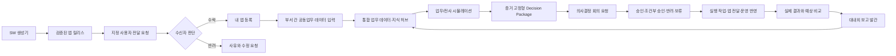

# 앱 전달·수락과 시뮬레이션 의사결정·보고 발간 폐쇄루프 설계

> 작성일: 2026-08-03  
> 상태: 제품 상세기획 완료 / **Supervisor 클릭형 UI 기준선 승인** / 실제 제품 구현 미착수  
> 구현 작업서: `docs/uiux/CLAUDE_IMPLEMENTATION_WORK_ORDER_CLOSED_LOOP_2026-08-03.md`  
> 연결 문서: `design_backbone_system_platform.md`, `design_org_permission_enterprise.md`, `design_enterprise_context_master.md`, `LLM_MASTER_IMPLEMENTATION_SPEC_2026-07-28.md`, `AI_FACTORY_STUDIO_PRODUCT_BIBLE.md`, `uiux/LIVING_ENTERPRISE_SCREEN_FUNCTION_DEFINITION_2026-07-30.md`  
> 핵심 전제: 생성 앱은 AI Factory Studio 안에서 실행되는 App-in-App이며, 인증·조직 문맥·권한·감사·데이터 접근은 호스트 플랫폼이 제공한다.

## UI 검증 산출물

- 통합 협업 허브: `uiux-prototypes/closed-loop-product-samples/index.html`
  - `#delivery`: 검증 릴리스 선택, 지정 사용자·역할, 최소 권한 영향, 전달 요청
  - `#inbox`: 받은 앱 승인/거절, 내 앱 등록, 보낸 전달 요청 추적
  - `#decision`: 시뮬레이션 결과, 역할별 검토서 3종, 회의 요청
  - `#publication`: 대내·대외 발간 분리, 근거·민감정보·책임자·법무/공시 게이트
- Factory 연결: `uiux-prototypes/sw-factory-concepts/transparent-orchestration/index.html`
  - 상단 `릴리스·사용자 전달` 진입점
  - 생성 단계의 `App-in-App 플랫폼 계약 적용` 표시
- 제품 셸 연결: `uiux-prototypes/m6-product-samples/index.html`의 전역 `협업` 메뉴

UI 샘플은 1280px 화면에서 Factory→전달 화면 이동, 받은 앱 승인·내 앱 등록, 역할별 Decision Package 전환, 회의 요청, 대외 발간의 이중 승인 게이트를 확인했다. 이 검증은 정적 프로토타입에 대한 것이며 실제 API·DB·권한 강제 구현을 의미하지 않는다.

---

## 1. 제안 기능의 제품적 의미

이번 제안은 여섯 개의 독립 기능이 아니라 두 개의 업무 순환과 하나의 플랫폼 규칙이다.

### 순환 A — 생성 앱의 부서 간 전달과 공동운영

```text
현업 앱 생성
→ 특정 사용자에게 전달 요청
→ 수신자가 목적·권한·역할 검토
→ 수락 또는 반려
→ 내 앱에 등록
→ 필요한 업무 입력·검토 수행
→ 결과가 원 업무와 전사 데이터에 연결
```

### 순환 B — 시뮬레이션에서 실행결정과 보고까지

```text
업무 데이터 축적
→ 시뮬레이션 실행
→ 중요 변화·선택안 탐지
→ Decision Package 생성
→ 의사결정 회의 요청
→ 결정·조건·책임자 기록
→ 실행 작업 또는 앱 전달
→ 실제 결과 추적
→ 대내외 보고 발간
→ 지식 허브·모델 보정
```

### 플랫폼 규칙 — 인증과 보안을 앱마다 다시 만들지 않는다

생성 앱은 별도 회원가입·로그인·비밀번호·JWT 발급 기능을 만들지 않는다. 플랫폼이 검증한 사용자·회사·조직·역할·데이터 범위를 상속받고, 생성 앱은 업무 기능에만 집중한다.

---

## 2. 전체 To-Be 폐쇄루프



핵심은 앱 전달과 의사결정을 분리하지 않는 것이다. 의사결정 결과가 실행 책임자에게 `work_item` 또는 앱 전달 요청으로 이어져야 시뮬레이션이 보고서에서 끝나지 않고 현장운영으로 연결된다.

---

## 3. 기능군 A — 지정 사용자 앱 전달 요청

### 3.1 제품 용어

사용자 화면에서는 강제 설치처럼 보이는 `앱 푸시`보다 **앱 전달 요청**을 기본 용어로 사용한다.

- 송신자 행동: `사용자에게 전달`
- 수신함: `받은 앱`
- 수락 결과: `내 앱에 추가`
- 송신함: `보낸 앱·처리상태`
- 강제 업무배정이 필요한 경우: 앱 전달과 별개의 `업무 배정` 사용

### 3.2 전달 요청에 포함할 정보

| 항목 | 설명 |
|---|---|
| 앱·릴리스 | `release_id`, 앱명, 버전, 소유 조직 |
| 전달 대상 | `target_user_id`; 추후 역할·사용자 그룹 지원 |
| 전달 목적 | 왜 이 사용자가 이 앱을 받아야 하는가 |
| 기대 역할 | 열람, 입력, 검토, 승인, 운영, 복제 중 허용 역할 |
| 업무 진입점 | 화면·탭·기능·레코드로 연결되는 딥링크 |
| 요청 업무 | 입력하거나 판단해야 할 내용 |
| 기한·우선순위 | 선택 입력, SLA 계산 가능 |
| 필요 권한 | 앱이 요청하는 데이터·행동 권한의 명시적 목록 |
| 버전 정책 | 특정 버전 고정, 승인된 업데이트 수동 적용 |
| 메시지·첨부 | 전달 사유, 업무 안내, 근거 문서 |

### 3.3 전달 모드

| 모드 | 수신자가 할 수 있는 일 | 사례 |
|---|---|---|
| `USE` | 앱 실행·허용된 데이터 열람 | 참고 앱 공유 |
| `CONTRIBUTE` | 지정 화면·필드·레코드 입력 | 물류 담당자의 통관·도착·이동 정보 입력 |
| `REVIEW` | 결과 검토·의견·승인 | 데이터 오너 검토 |
| `FORK` | 원본 계보를 유지한 복제 프로젝트 생성 | 부서 특화 버전 개발 |

원료도입계획 사례는 단순 `read share`가 아니라 `CONTRIBUTE`다. 따라서 앱을 보여주는 것뿐 아니라 담당 화면, 허용 필드, 대상 레코드와 업무기한까지 함께 전달해야 한다.

### 3.4 조직 공유와 개인 전달의 분리

현재 `workspace_shares`는 조직 범위의 읽기·복제 권한이다. 신규 전달 기능은 다음과 같이 분리한다.

```text
조직 공유 계약
  = 해당 조직이 앱에 접근할 수 있는가

개인 전달 요청
  = 그 조직의 특정 사용자가 이 앱을 받아 자신의 업무도구로 등록할 것인가
```

수신자가 앱을 수락해도 데이터 권한이 자동 확대되면 안 된다. 최종 유효 권한은 다음 교집합이다.

```text
유효 권한
= 송신자가 위임할 수 있는 범위
∩ 조직 공유 계약
∩ 수신자 본래 권한
∩ 앱 Capability Manifest
∩ 해당 업무/레코드 범위
```

교집합이 비어 있거나 필요한 권한 일부가 승인되지 않으면 `수락 가능`이 아니라 `권한 승인 필요` 상태로 표시한다.

### 3.5 상태 전이

```text
DRAFT
→ SENT
→ DELIVERED
→ ACCEPTED | REJECTED | EXPIRED | REVOKED

예외 상태:
PENDING_PERMISSION = 접근 계약 또는 데이터 권한 승인 대기
SUPERSEDED = 더 최신 전달 요청으로 대체
```

`REJECTED`는 실패가 아니다. 수신자가 사유를 남기면 송신자가 역할·권한·업무범위를 수정해 재전달할 수 있어야 한다.

---

## 4. 기능군 B — 받은 앱 검토·수락과 내 앱 주머니

### 4.1 수신자가 판단해야 하는 정보

수락 화면에는 최소한 다음을 한 화면에 보여준다.

1. 누가, 어느 조직에서 보냈는가.
2. 앱이 해결하려는 업무와 내가 맡을 역할은 무엇인가.
3. 어떤 데이터에 접근하고 무엇을 변경할 수 있는가.
4. 업무 기한과 선행·후행 업무는 무엇인가.
5. 앱의 검증·승인·운영 상태와 버전은 무엇인가.
6. 수락하면 내 업무와 알림에 어떤 변화가 생기는가.
7. 거절하면 어느 프로세스가 멈추고 누구에게 통보되는가.

### 4.2 수신자 선택

- `수락하고 내 앱에 추가`
- `권한 확인 후 수락`
- `반려` — 반려 사유 필수
- `담당자 변경 요청`
- `나중에 결정` — 기한과 영향 표시

### 4.3 내 앱 주머니의 역할

내 앱 주머니는 단순 즐겨찾기가 아니라 사용자별 업무 실행 레지스트리다.

| 필드 | 역할 |
|---|---|
| `user_id`, `release_id` | 사용자와 앱 릴리스 연결 |
| `delivery_id` | 어떤 전달을 통해 등록됐는지 추적 |
| `role_mode` | USE/CONTRIBUTE/REVIEW/FORK |
| `entrypoint` | 기본 진입 화면 |
| `pinned_version` | 승인한 버전 고정 |
| `status` | active, paused, archived, revoked |
| `last_opened_at` | 최근 사용 |
| `notification_policy` | 업무·업데이트 알림 설정 |
| `display_order`, `favorite` | 개인화 |

앱의 새 버전이 나와도 자동으로 업무 동작을 바꾸지 않는다. 변경 영향과 권한 차이를 보여준 뒤 사용자가 승인하거나 관리 정책에 따라 전환한다.

### 4.4 화면

**받은 앱 수신함**
- 새 요청, 권한 대기, 수락, 반려, 만료 탭
- 보낸 사람·목적·역할·기한·필요 권한·업무 영향 표시
- 한 번의 수락으로 조직 권한까지 우회하지 못하도록 권한 상태 분리

**내 앱**
- 내가 만든 앱 / 전달받은 앱 / 부서 공용 앱 / 검토 전용 앱 구분
- 앱 카드에서 미처리 업무 수, 데이터 최신성, 운영 상태, 버전, 소유자 표시
- 앱 실행 시 호스트 문맥과 권한을 자동 전달

**보낸 앱**
- 수신·수락·반려·권한 대기 상태
- 미응답 사용자 재알림, 대상 변경, 전달 회수

---

## 5. 플랫폼 규칙 C — App-in-App 인증·권한 상속

### 5.1 생성 앱에서 금지할 것

현재 제품 범위에서 생성 Agent는 다음을 생성하지 않는다.

- 회원가입·로그인·로그아웃 화면
- 사용자·비밀번호 테이블
- 자체 비밀번호 해시·재설정·OTP
- 자체 JWT 발급·Refresh Token·세션 저장소
- 임의 역할·권한 관리자
- 호스트 사용자와 별개의 계정체계
- DB 비밀번호·API Key의 프론트엔드 저장

향후 플랫폼 밖에 독립 배포하는 앱을 지원한다면 `standalone`이라는 별도 앱 등급과 인증 템플릿을 명시적으로 도입한다. 현재 App-in-App 생성 규약과 섞지 않는다.

### 5.2 호스트가 제공할 Runtime Context

```json
{
  "principal": {
    "user_id": "u-logistics-01",
    "tenant_id": "ls-group",
    "enterprise_scope_id": "ls-mnm-logistics",
    "entity_mode": "REAL",
    "roles": ["logistics_operator"]
  },
  "app": {
    "release_id": "raw-material-plan-v3",
    "delivery_id": "adl_...",
    "role_mode": "CONTRIBUTE",
    "allowed_actions": ["shipment.read", "arrival.write", "movement.write"]
  },
  "request": {
    "correlation_id": "...",
    "locale": "ko-KR"
  }
}
```

클라이언트가 전달한 이 값을 그대로 신뢰하지 않는다. 서버의 Platform Gateway가 현재 세션·ECM·조직 관계·Scope Contract·전달 계약을 다시 평가해 최종 권한을 결정한다.

### 5.3 Capability Manifest

모든 생성 앱 릴리스는 다음 선언을 가진다.

```json
{
  "required_capabilities": [
    {"resource": "raw_material_shipment", "actions": ["read"]},
    {"resource": "arrival_event", "actions": ["create", "update"]}
  ],
  "entrypoints": [
    {"id": "logistics-input", "path": "/logistics", "purpose": "물류 정보 입력"}
  ],
  "app_class": "departmental",
  "host_auth_required": true,
  "standalone_auth": false
}
```

### 5.4 Agent와 품질 게이트 변경

| 대상 | 추가 규칙 |
|---|---|
| RFP/PM | 앱 내부 로그인 요구를 호스트 권한 상속 요구로 변환 |
| Architect | Platform Gateway와 Capability Manifest를 아키텍처 계약에 포함 |
| Tech Lead | 사용자·역할·조직 문맥을 직접 구현하지 않고 Host SDK 사용 |
| Backend | 자체 사용자·세션 테이블 생성 금지, 데이터 접근은 Runtime API 사용 |
| Frontend | 로그인 화면 대신 현재 사용자·조직·역할과 권한 제한 상태 표시 |
| Reviewer | 자체 인증 코드, 권한 우회, 직접 DB 접근을 결함으로 판정 |
| QA | 다른 사용자·조직·역할로 같은 앱을 실행해 권한 경계 검증 |

결정론적 정적 검사도 추가한다. 생성 파일에서 로그인 폼, password 컬럼, JWT 발급, 사용자 테이블, 인증 라이브러리를 탐지한다. 단, 업무상 `승인`, `전자서명 확인`, 외부 API 인증은 앱 로그인과 구분해 오탐을 방지한다.

### 5.5 현재 테스트 시나리오의 수정 필요

기존 `docs/test_plan/01_scenario_catalog.md`의 사내 게시판 시나리오는 앱 내부 로그인 구현을 요구한다. App-in-App 원칙 확정 시 다음으로 변경한다.

```text
기존: 앱 자체 아이디/비밀번호 로그인
변경: 호스트가 주입한 관리자/일반직원 역할에 따라 작성·열람·댓글 권한이 달라짐
```

이는 구현 단계에서 테스트 문서와 스킬을 함께 바꿔야 하며, 문서만 바꾸고 품질 게이트를 그대로 두면 규칙이 작동하지 않는다.

---

## 6. 기능군 D — 시뮬레이션 기반 의사결정 회의 요청

### 6.1 요청 생성 조건

모든 시뮬레이션이 회의 요청을 만들면 알림 폭주가 발생한다. 다음 조건 중 하나 이상을 만족하고 사용자가 확인한 경우에만 Decision Case를 만든다.

- 중요 KPI가 승인 임계치를 초과
- 기준 시나리오 대비 손익·현금·납기·품질·재고 영향이 유의미
- 여러 부서의 목표 또는 제약이 충돌
- 운영 반영에 예산·정책·인력·설비 변경이 필요
- 시나리오 간 우열이 자동 판정되지 않고 경영 판단이 필요
- 사용자가 명시적으로 `의사결정 요청`을 선택

LLM은 중요 후보와 설명을 제안할 수 있지만 임계치 초과, 계산값, 권한, 의사결정권자 판정은 규칙과 ECM/RACI가 담당한다.

### 6.2 회의 요청 전에 고정할 증거

- `simulation_run_id`, 시나리오·기준선 ID
- 입력 데이터 스냅샷과 해시
- 실제/계획/전망/가정/외부사건 구분
- 외부지표 기준시각과 vintage
- 계산 엔진·산식·모델 버전
- 민감도·신뢰구간·Backtest 결과
- 주요 가정과 미확보 데이터
- 기준안, 대안, 아무것도 하지 않는 안
- 각 대안의 재무·운영·조직·리스크 영향

회의 요청 후 원천 데이터가 바뀌어도 검토서 숫자를 자동 갱신하지 않는다. `근거 변경 감지·재검토 필요` 상태로 전환한다.

### 6.3 회의 요청 내용

| 항목 | 내용 |
|---|---|
| 요청 제목·목적 | 무엇을 결정하기 위한 회의인가 |
| 결정 안건 | 승인받아야 하는 선택을 문장으로 명확화 |
| 선택지 | 기준안·대안·무행동안 |
| 권고안 | 요청자 권고와 근거, 반대 근거 포함 |
| 의사결정권자 | ECM·직책·금액/정책 위임규정으로 결정 |
| 필수 참석자 | 실행 책임자·데이터 오너·영향 부서 |
| 사전 검토자 | 회의 전 의견이 필요한 사용자 |
| 기한 | 결정 필요일과 지연 영향 |
| 사전자료 | 세 관점 검토서와 증거 부록 |
| 결정 후 행동 | 자동 생성할 실행 작업과 책임자 후보 |

내부 Decision Queue에는 자동으로 `DRAFT` 요청을 만들 수 있다. 실제 캘린더 초대·메일·Slack/Teams 발송은 외부 쓰기이므로 사용자의 최종 확인 후 수행한다.

### 6.4 상태 전이

```text
DRAFT
→ EVIDENCE_READY
→ REVIEW_REQUESTED
→ SCHEDULED
→ HELD
→ APPROVED | CONDITIONALLY_APPROVED | REJECTED | DEFERRED
→ EXECUTION_PENDING
→ APPLIED
→ EFFECT_MEASURED

보조 상태:
STALE_EVIDENCE, CANCELLED, SUPERSEDED
```

결정 결과는 Decision Ledger에 변경 불가능한 이벤트로 기록하고, 정정은 기존 기록 삭제가 아니라 `CORRECTION`으로 잇는다.

---

## 7. 기능군 E — 세 관점의 자동 검토서

### 7.1 가장 중요한 원칙: 원본은 하나, View는 셋

세 검토서를 각각 독립 생성하면 숫자·가정·권고안이 달라질 수 있다. 따라서 하나의 구조화된 **Decision Package**를 만들고 관점별 렌더링만 다르게 한다.

```text
Canonical Decision Package
  ├ 요청자 제안 검토서
  ├ 의사결정자 판단 검토서
  └ 영향 부서별 영향 검토서
```

### 7.2 공통 Decision Package 구조

| 영역 | 필수 내용 |
|---|---|
| 문제·결정 | 지금 무엇을 왜 결정해야 하는가 |
| 기준선 | 현재 상태와 아무 조치도 하지 않을 때 결과 |
| 대안 | 선택지, 비용, 효과, 시간, 제약 |
| 권고 | 권고안과 채택·기각 근거 |
| 영향 | 손익·현금·원가·생산·품질·물류·인력·리스크 |
| 불확실성 | 민감도, 신뢰구간, 데이터 결손, 반대 가설 |
| 실행 | 책임자, 일정, 선행조건, 롤백 조건 |
| 증거 | 데이터·산식·시뮬레이션·문서·승인 참조 |
| 결정 양식 | 승인/조건부/반려/보류와 조건 입력 |

### 7.3 요청자 제안 검토서

목적은 “왜 이 안건을 올렸고 무엇을 승인받고 싶은가”를 명확히 하는 것이다.

- 현업 문제와 발생 배경
- 시뮬레이션을 수행한 이유
- 요청자의 권고안
- 필요한 의사결정 문장
- 요청 예산·정책·인력·설비·일정
- 기대효과와 미결 리스크
- 요청자가 책임질 후속 행동
- 반려·지연 시 업무 영향

### 7.4 의사결정자 판단 검토서

목적은 빠르게 결론을 강요하는 것이 아니라 선택지와 손실 가능성을 비교하게 하는 것이다.

- 1페이지 Executive Brief
- 결정 안건과 마감일
- 기준안·권고안·대안·무행동안 비교
- 손익·현금·투자회수·운영 KPI 영향
- 최악/기준/최선 범위와 민감도
- 되돌릴 수 있는 결정인지 여부
- 규정·안전·데이터 품질·평판 리스크
- 반대 의견과 불확실성
- 승인 시 조건과 중간 점검 기준
- 의사결정 입력란

### 7.5 영향 부서 검토서

부서마다 별도 원본을 만들지 않고 동일 Package에서 부서별 View를 생성한다.

- 해당 부서에 바뀌는 업무·KPI·책임
- 새로 입력하거나 제공해야 할 데이터
- 인력·설비·재고·일정·원가 영향
- 선행·후행 부서와의 의존성
- 예상되는 충돌·병목·예외
- 부서 의견: 동의, 조건부 동의, 반대, 정보 부족
- 수행 책임자와 완료기한
- 미이행 시 전사 영향

### 7.6 생성 방식

- 숫자·대안 비교표·임계치: 결정론적 계산 결과에서 직접 바인딩
- 근거·출처·버전: Evidence Registry와 Lineage에서 직접 바인딩
- 권한·참석자·영향부서: ECM·RACI·프로세스 관계에서 계산
- 설명·요약·문장 다듬기: LLM 사용 가능
- LLM이 새 숫자·근거·의사결정자를 발명하면 검증 실패

---

## 8. 기능군 F — 시뮬레이션 기반 대내외 보고 발간

### 8.1 발간 대상

| 유형 | 주요 독자 | 예시 |
|---|---|---|
| 내부 운영 보고 | 업무부서·관리자 | 원료도입, 생산·재고·물류 전망 |
| 경영 보고 | 경영진·이사회 | 손익·현금흐름·리스크 시나리오 |
| 전사 공유 보고 | 임직원 | 승인된 경영방향·핵심 실행계획 |
| 대외 제한 보고 | 고객·파트너·금융기관 | 공급·투자·ESG 관련 승인 정보 |
| 대외 공개 보고 | 공시·IR·지속가능경영 | 법무·IR·보안 승인 후 공개 |

### 8.2 발간 원칙

1. 실행 중인 가변 시뮬레이션이 아니라 승인된 Snapshot만 발간한다.
2. 내부용과 외부용은 같은 원본 Package를 사용하되 공개 범위와 집계 수준을 다르게 렌더링한다.
3. 외부 발간은 자동 게시하지 않는다. 법무·IR·보안·데이터 오너의 승인 게이트를 거친다.
4. 기밀·개인정보·원천 계약상 재배포 금지 데이터는 제거하거나 집계한다.
5. 모든 주요 숫자는 근거·기준시각·산식·버전을 추적할 수 있어야 한다.
6. 발간 후 원천이 바뀌어도 문서를 덮어쓰지 않는다. 정정판·개정판을 새 버전으로 발행한다.

### 8.3 발간 흐름

```text
승인된 Simulation/Decision Snapshot 선택
→ 보고서 유형·독자·보안등급 선택
→ 구조화 보고서 초안 생성
→ 수치·근거·인용 Fact Lock
→ 내부/외부 공개범위 필터·비식별·집계
→ 검토·승인
→ PDF/Word/HTML/대시보드 렌더링
→ 배포·열람범위 적용
→ 발간본·근거 Snapshot 보존
→ 정정·철회·후속 실적 비교
```

### 8.4 보고서 필수 메타데이터

- `publication_id`, 유형, 제목, 독자, 언어
- 회사·조직·REAL/VIRTUAL 문맥
- 기준기간·기준시각·발간일·embargo
- 참조한 simulation/decision/evidence ID
- 보안등급·배포채널·허용 수신자
- 생성자·검토자·승인자·발행자
- 버전·정정 대상·대체 발간본
- 공개 제외 항목과 제외 사유

---

## 9. 통합 데이터 모델 초안

### 9.1 앱 전달·내 앱

```text
app_deliveries
  delivery_id PK
  release_id
  sender_user_id
  sender_scope_id
  target_user_id
  target_scope_id
  delivery_mode
  entrypoint_id
  work_item_id nullable
  purpose, message
  due_at, priority
  required_capabilities_json
  status
  expires_at
  created_at, responded_at, revoked_at

app_delivery_responses
  response_id PK
  delivery_id
  user_id
  decision
  reason
  permission_snapshot_json
  created_at

user_app_pocket
  pocket_id PK
  user_id
  release_id
  delivery_id
  role_mode
  entrypoint_id
  pinned_version
  status
  favorite, display_order
  notification_policy_json
  added_at, last_opened_at

app_capability_manifests
  release_id PK
  manifest_version
  host_auth_required
  standalone_auth
  capabilities_json
  entrypoints_json
  generated_at, approved_at
```

다수 대상 전달은 `app_deliveries`를 한 건씩 복제하지 않고 향후 `delivery_campaigns`와 `delivery_recipients`로 확장할 수 있다. 최초 구현은 지정 사용자 1명 단위로 시작한다.

### 9.2 의사결정

```text
decision_cases
  decision_case_id PK
  simulation_run_id
  scope_id, entity_mode
  title, decision_question
  status, due_at
  baseline_snapshot_id
  evidence_hash
  requested_by
  created_at, updated_at

decision_options
  option_id PK
  decision_case_id
  option_type
  title, description
  metrics_json
  risk_json
  reversibility

decision_evidence
  link_id PK
  decision_case_id
  evidence_type, evidence_id
  snapshot_hash, as_of, vintage

decision_participants
  participant_id PK
  decision_case_id
  user_id, scope_id
  participant_role
  response_status, response_note

decision_actions
  action_id PK
  decision_case_id
  owner_user_id, owner_scope_id
  work_item_id, delivery_id nullable
  action, due_at, status
  expected_metric_json
  actual_metric_json
```

세 종류의 검토서는 별도 원본 테이블이 아니라 `decision_cases`와 관련 구조를 기준으로 렌더링한다. 필요하면 렌더링 결과만 `artifact_versions`에 보존한다.

### 9.3 보고 발간

```text
publications
  publication_id PK
  publication_type
  title, audience_type
  scope_id, entity_mode
  security_classification
  source_decision_case_id nullable
  source_simulation_run_id nullable
  status
  embargo_at, published_at
  created_by

publication_versions
  version_id PK
  publication_id
  version_no
  document_ast_json
  rendered_files_json
  evidence_hash
  redaction_policy_json
  approval_snapshot_json
  supersedes_version_id nullable
  created_at
```

---

## 10. API 초안

### 10.1 앱 전달·수락

| Method | Endpoint | 역할 |
|---|---|---|
| POST | `/api/v1/app-deliveries` | 지정 사용자에게 앱 전달 요청 |
| GET | `/api/v1/app-deliveries/inbox` | 나에게 온 요청 |
| GET | `/api/v1/app-deliveries/outbox` | 내가 보낸 요청과 상태 |
| GET | `/api/v1/app-deliveries/{id}` | 권한·앱·업무 영향 포함 상세 |
| POST | `/api/v1/app-deliveries/{id}/accept` | 권한 재검증 후 수락·내 앱 등록 |
| POST | `/api/v1/app-deliveries/{id}/reject` | 사유 포함 반려 |
| POST | `/api/v1/app-deliveries/{id}/reassign-request` | 담당자 변경 요청 |
| POST | `/api/v1/app-deliveries/{id}/revoke` | 송신자 회수 |
| GET | `/api/v1/me/apps` | 내 앱 주머니 |
| PATCH | `/api/v1/me/apps/{pocket_id}` | 즐겨찾기·순서·알림·보관 설정 |

`accept`는 멱등해야 한다. 중복 클릭으로 Pocket 레코드나 권한이 중복 생성되지 않아야 한다.

### 10.2 의사결정

| Method | Endpoint | 역할 |
|---|---|---|
| POST | `/api/v1/simulations/{run_id}/decision-cases` | 시뮬 결과에서 안건 초안 생성 |
| GET | `/api/v1/decisions/queue` | 권한 범위의 결정 대기열 |
| GET | `/api/v1/decisions/{id}` | Package·선택지·증거·참여자 조회 |
| POST | `/api/v1/decisions/{id}/generate-views` | 세 관점 검토서 렌더링 |
| POST | `/api/v1/decisions/{id}/request-review` | 내부 사전검토 요청 |
| POST | `/api/v1/decisions/{id}/request-meeting` | 회의 요청 초안 생성 |
| POST | `/api/v1/decisions/{id}/participant-response` | 영향부서 의견 제출 |
| POST | `/api/v1/decisions/{id}/decide` | 승인·조건부·반려·보류 기록 |
| POST | `/api/v1/decisions/{id}/create-actions` | 실행 작업·앱 전달 생성 |
| POST | `/api/v1/decisions/{id}/measure-effect` | 예상 대비 실제 효과 기록 |

### 10.3 보고 발간

| Method | Endpoint | 역할 |
|---|---|---|
| POST | `/api/v1/publications` | 승인 Snapshot에서 발간 초안 생성 |
| GET | `/api/v1/publications` | 유형·독자·상태별 검색 |
| GET | `/api/v1/publications/{id}` | 발간본·근거·승인 조회 |
| POST | `/api/v1/publications/{id}/render` | PDF/Word/HTML 렌더링 |
| POST | `/api/v1/publications/{id}/request-approval` | 승인 요청 |
| POST | `/api/v1/publications/{id}/approve` | 권한별 승인 |
| POST | `/api/v1/publications/{id}/publish` | 승인 완료 후 배포 |
| POST | `/api/v1/publications/{id}/correct` | 정정판 생성 |
| POST | `/api/v1/publications/{id}/withdraw` | 철회; 이력은 유지 |

---

## 11. 기존 자산 재사용과 신규 범위

| 기존 자산 | 재사용 | 추가가 필요한 것 |
|---|---|---|
| `workspace_shares` | 조직 단위 접근 계약 | 사용자별 전달·수락·Pocket |
| Workspace Promotion | 전사 승격 게이트 | 개인 전달과 혼합하지 않음 |
| `work_items` 설계 | 앱 전달에 연결할 업무 배정 | 실제 저장소·API·인박스 구현 |
| ECM·Scope Contract | 송수신자·권한·영향부서 판정 | 전달 계약을 평가축에 추가 |
| SSE Broadcaster | 전달·결정·회의·발간 알림 | 사용자별 구독 필터·재접속 복구 |
| Decision Ledger | 승인·반려·실행 결정 기록 | 신규 이벤트 배선 |
| Shadow Mode | 운영 반영 전 후보 검증 | 결정 승인 결과와 승격 연결 |
| Report Studio 설계 | 구조화 문서·근거·승인·PDF/Word | 시뮬 Snapshot·Decision Package 연결 |
| Data Lineage | 앱·데이터·보고서 관계 | 전달·결정·발간 간선 유형 추가 |

### 현재 구현과의 냉정한 경계

- 현재 앱 공유는 조직 단위 `read/fork`이며 사용자 수락 흐름이 아니다.
- 현재 생성 앱은 영구 운영 Runtime이 아니라 Preview·Release 중심이다.
- 현재 시스템 전체 인증도 운영용 SSO가 아니라 경량 사용자 식별 단계다.
- 현재 보고서는 UI·설계가 중심이며 구조화 Document AST와 발간 Workflow가 완결되지 않았다.
- 현재 시뮬레이션 결과를 정식 Decision Case로 전환하는 저장소·API가 없다.

따라서 화면만 먼저 붙이면 “보내기·승인·회의·발간처럼 보이지만 실제 권한과 업무가 움직이지 않는” 장식 기능이 된다. 상태·권한·감사·계보를 먼저 고정해야 한다.

---

## 12. 권한·보안·감사 비협상 조건

1. 송신자는 자신이 갖지 않은 데이터·행동 권한을 위임할 수 없다.
2. 수락은 데이터 권한 승인과 동일하지 않다.
3. 다른 조직의 앱·요청 존재 자체를 볼 권한이 없으면 404로 은폐한다.
4. 대상 사용자·조직은 클라이언트 입력만 신뢰하지 않고 서버에서 재해석한다.
5. 수락 시점의 앱 버전·Capability·권한 평가 결과를 Snapshot으로 남긴다.
6. 전달 회수 후 Pocket 실행과 열린 세션의 권한을 즉시 재평가한다.
7. Decision Package의 숫자와 근거는 생성 후 해시로 고정한다.
8. 외부 발간은 별도 승인과 비식별·재배포 계약 검사를 거친다.
9. 앱 iframe은 `allow-same-origin`을 제거하거나 별도 Origin으로 격리하고 부모 DOM·토큰에 접근하지 못하게 한다.
10. 모든 전달·수락·반려·결정·발간·정정·철회 이벤트를 감사와 Decision Ledger에 기록한다.

---

## 13. 화면 배치 제안

### 13.1 Release Studio

`사용자에게 전달` 버튼을 추가한다. 전달 Wizard는 다음 4단계로 구성한다.

1. 대상 사용자 선택
2. 역할·진입화면·요청 업무 선택
3. 필요 권한과 데이터 영향 검토
4. 기한·메시지 확인 후 전달

### 13.2 개인 홈

- `받은 앱` 알림 배지
- `내 앱` 주머니
- `내 업무` 인박스
- `내 결정` 검토 요청
- `내가 보낸 요청` 처리상태

### 13.3 Simulation Studio

시뮬레이션 결과 화면에 다음을 추가한다.

- `의사결정 요청` 버튼
- 의사결정 필요성·임계치·근거 준비도
- 요청자/의사결정자/영향부서 View 탭
- 참석자·기한·안건 편집
- 결정 후 생성될 실행 작업 Preview

### 13.4 Decision Center

- 결정 대기열: 긴급도, 금액/운영 영향, 기한, 증거 최신성
- 선택지 비교: 기준·권고·대안·무행동
- 영향 지도: 회사·사업부·부서·공장·KPI
- 참여자 의견: 동의·조건부·반대·정보 부족
- 결정 입력: 승인·조건부·반려·보류
- 결정 후 실행 상태와 실제 효과

### 13.5 Report Studio

기존 보고서 화면에 `시뮬레이션/의사결정 Snapshot 선택`, `내부/외부 View`, `공개범위 검사`, `발간 승인`, `정정판`을 추가한다.

---

## 14. 구현 단계와 우선순위

### Phase A — App-in-App 생성 규약 고정

가장 먼저 수행한다. 새 앱을 만들 때마다 불필요한 로그인·사용자 DB가 쌓이는 것을 즉시 막는다.

- Agent Skill·Context 계약 수정
- Capability Manifest 스키마
- 자체 인증 코드 정적 게이트
- 호스트 역할 기반 테스트 시나리오 개정

**완료 기준**: 생성 앱이 별도 로그인 없이 호스트 사용자·조직·역할에 따라 기능을 다르게 제공하고, 자체 인증 코드가 품질 게이트에서 차단된다.

### Phase B — 지정 사용자 전달·수락·내 앱

- `app_deliveries`, response, pocket 저장소
- 조직 Share·Scope Contract와 결합
- 수신함·송신함·내 앱 UI
- SSE 알림과 재접속 복구
- 단일 사용자 지정 전달부터 시작

**완료 기준**: 원료구매 담당자가 물류 담당자에게 `CONTRIBUTE`로 앱을 보내고, 물류 담당자가 권한을 확인해 수락한 뒤 내 앱에서 지정 화면으로 진입한다.

### Phase C — Decision Package와 세 관점 View

- 시뮬 Snapshot·증거 고정
- Decision Case·Option·Participant 모델
- 세 관점 템플릿
- 수치 Fact Lock과 근거 검증

**완료 기준**: 동일 Package에서 세 검토서를 생성했을 때 모든 공통 숫자·가정·버전·결정 안건이 일치한다.

### Phase D — 회의 요청과 실행 연결

- 내부 Decision Queue·사전검토
- 회의요청 초안·참석자/RACI 판정
- 사용자 확인 후 Calendar/Slack/Teams 연계
- 결정 결과에서 `work_item`·앱 전달 생성

**완료 기준**: 승인된 안건이 실행 책임자·기한·업무 앱 진입점을 가진 후속 작업으로 전환되고 Ledger에 연결된다.

### Phase E — 대내외 보고 발간

- Publication·Version 모델
- 내부/외부 공개 필터
- 승인·비식별·재배포 계약 게이트
- PDF/Word/HTML 렌더·정정·철회

**완료 기준**: 승인 Snapshot에서 내부 보고서와 외부 제한 보고서를 서로 다른 공개범위로 생성하고, 외부본에 기밀 데이터가 포함되면 발간이 차단된다.

### Phase F — 실제 결과 학습 폐쇄루프

- 결정 전 예상 KPI와 실행 후 실제 KPI 비교
- 시뮬레이션 오차·가정·Driver Mapping 개선 후보 생성
- 검토 승인 후 지식 허브·모델 버전 갱신

**완료 기준**: 과거 결정의 예상과 실제 차이가 다음 시뮬레이션의 데이터 품질·가정·모델 개선으로 연결된다.

---

## 15. 핵심 테스트 시나리오

### T1. 원료도입 다부서 앱 전달

1. 원료구매 담당자가 승인된 앱 릴리스를 물류 담당자에게 `CONTRIBUTE`로 전달한다.
2. 물류 담당자는 통관·도착·이동 화면과 필요한 권한만 확인한다.
3. 수락 후 내 앱에 등록되고 지정 화면으로 이동한다.
4. 구매 단가·계약조건 등 비허용 필드는 보이지 않거나 수정 불가다.
5. 입력 완료가 원료도입 업무의 다음 단계로 연결된다.

### T2. 권한 부족 수락 차단

- 대상 사용자가 앱은 받았지만 데이터 권한이 없으면 `PENDING_PERMISSION`으로 표시한다.
- 수락 버튼이 권한 우회로 동작하지 않는다.

### T3. 앱 전달 회수

- 송신자가 전달을 회수하면 수신자의 Pocket 상태가 revoked로 바뀐다.
- 이미 열린 화면의 다음 API 호출에서 권한이 재평가된다.
- 과거 열람·입력 이력은 삭제되지 않는다.

### T4. App-in-App 인증 상속

- 같은 앱을 관리자와 일반직원으로 실행한다.
- 앱 내부 로그인 없이 호스트 역할에 따라 기능이 달라진다.
- 생성물에 password/JWT/user table이 있으면 릴리스 게이트가 실패한다.

### T5. 시뮬레이션 의사결정 Package

- 전기료 상승 시나리오에서 기준·대안·무행동안을 만든다.
- 세 관점 검토서의 공통 숫자와 증거 해시가 동일하다.
- 영향부서마다 업무·KPI·책임 View만 다르다.

### T6. 근거 변경

- 회의 요청 후 외부지표가 개정되면 기존 검토서를 덮어쓰지 않는다.
- `STALE_EVIDENCE`로 전환하고 재검토 전 결정을 차단하거나 명시적 인지를 요구한다.

### T7. 결정에서 실행으로

- 조건부 승인 시 조건·기한·책임자가 `decision_actions`와 `work_items`로 생성된다.
- 필요한 업무 앱이 책임자의 받은 앱에 전달된다.

### T8. 대외 보고 발간 차단

- 외부본에 confidential 필드나 재배포 불가 원천이 포함되면 publish가 차단된다.
- 집계·비식별 후 재승인하면 발간 가능하다.

---

## 16. 권고 결론

### 바로 확정해도 되는 것

1. 생성 앱은 App-in-App이며 플랫폼 인증·권한을 상속한다.
2. 앱 전달은 강제 배포가 아니라 수신자 수락형 전달 요청이다.
3. 조직 공유·사용자 전달·업무 배정·전사 승격은 서로 다른 상태와 API로 관리한다.
4. 세 검토서는 하나의 Decision Package에서 관점별로 렌더링한다.
5. 외부 보고 발간은 자동 게시하지 않고 승인·비식별·계약 게이트를 둔다.

### 구현 전 세부 확정이 필요한 것

1. 앱 전달을 지정 사용자 1명만 먼저 지원할지 역할·그룹까지 동시에 지원할지.
2. `CONTRIBUTE` 권한을 화면·필드·레코드 중 어느 수준부터 강제할지.
3. 앱 릴리스 업데이트를 수동 승인으로만 할지 조직 정책에 따른 자동 전환을 허용할지.
4. 의사결정권자·참석자 RACI 원천을 ECM 직책과 별도 위임규정 중 어디에 둘지.
5. 대외 보고 유형별 승인 체계를 법무·IR·보안·데이터 오너 중 어떻게 구성할지.

### 권장 착수 순서

```text
App-in-App 생성 규약
→ 지정 사용자 전달·수락·내 앱
→ Decision Package·세 관점 검토서
→ 회의 요청·실행 작업 연결
→ 대내외 보고 발간
→ 실제 결과 학습 폐쇄루프
```

첫 번째와 두 번째를 먼저 구현하면 기존 M3 부서 워크스페이스가 실제 사용자 협업으로 확장된다. 이후 의사결정 Package를 얹으면 M4 시뮬레이션이 실행 가능한 경영 프로세스로 바뀌고, 발간 기능은 그 결과를 공식 기업 자산으로 보존한다.
