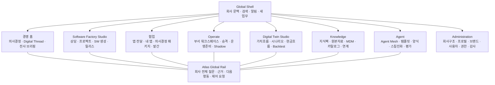
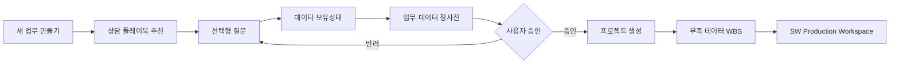
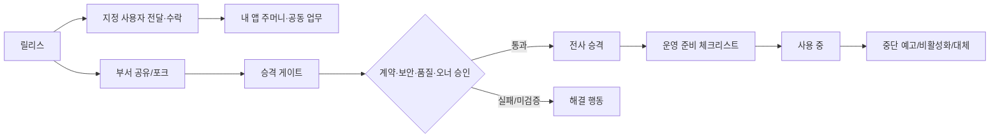
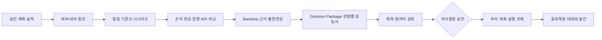
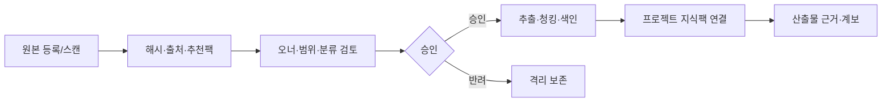

# AI Factory Studio · Living Enterprise Canvas
# 화면기능정의서

> 문서 버전: 1.0  
> 기준일: 2026-07-30  
> 화면 North Star: `uiux-prototypes/master-concept/index.html`  
> 제품 적용 상태: Supervisor 최종 승인 · M6 구현 인계 기준  
> 작성 목적: 현재 구현 기능을 승인된 디자인 구조에 배치하고, Claude Code가 기능 손실 없이 React 화면을 통합할 수 있는 화면 단위 계약을 제공한다.

---

## 1. 문서의 결론

AI Factory Studio의 메인 화면은 더 이상 기능 버튼을 나열한 런처가 아니다. 사용자가 현재 선택한 회사·사업부·공장 범위에서 다음 세 가지를 즉시 이해하고 행동하는 **Living Enterprise Canvas**가 된다.

1. 지금 무엇을 결정해야 하는가.
2. 그 결정이 어떤 업무·데이터·현업 SW·Agent·Digital Twin과 연결되는가.
3. 근거가 충분한지, 누가 무엇을 승인해야 하는지, 다음 행동은 무엇인가.

현재 `App.tsx`의 독립 전체화면 패널은 폐기하지 않는다. 각 패널의 API 클라이언트와 도메인 로직은 재사용하고, 아래 목표 정보구조의 상세 화면·드로어·작업공간으로 재배치한다.

---

## 2. 분석 기준과 구현 경계

### 2.1 기준 소스

- 메인 프론트 진입점: `frontend/src/App.tsx`
- 프로젝트·SSE 상태: `frontend/src/store/useFactoryStore.ts`
- 업무 상담: `AdvisorPanel.tsx`, `lib/advisorApi.ts`
- 전사 브리핑: `BriefingPanel.tsx`, `lib/briefingApi.ts`
- 경영계획: `PlanningPanel.tsx`, `lib/planningApi.ts`
- 부서 운영·승격: `WorkspacePanel.tsx`, `lib/workspaceApi.ts`
- Shadow Mode: `ShadowModePanel.tsx`, `lib/shadowApi.ts`
- 프로그램 수명주기: `ProgramAdminPanel.tsx`, `lib/programApi.ts`
- 데이터 거버넌스: `GovernanceConsole.tsx`, `lib/governanceApi.ts`
- 지식·원본자료: `KnowledgeHubPanel.tsx`, `api/routes/reference_control.py`, `core/reference_registry.py`
- 회사 구조·권한: `enterprise_context_control.py`, `org_control.py`, `OrgChartPanel.tsx`
- SW 생성: `ControlPanel.tsx`, `TimelinePanel.tsx`, `PreviewPanel.tsx`, `WorkflowStrip.tsx`, `HOTLInput.tsx`
- 에이전트·양식·스킬: `AgentMasterPanel.tsx`, `FormatMasterPanel.tsx`, `SkillEvolutionPanel.tsx`
- 운영 품질·비용: `TelemetryPanel.tsx`, `QualityOutcomesView.tsx`

### 2.2 구현 상태 표기

| 표기 | 의미 |
|---|---|
| **연결** | 현재 API와 데이터 계층을 그대로 사용해 화면을 만들 수 있음 |
| **재배치** | 기능은 있으나 현재 독립 패널을 목표 화면 구조로 옮겨야 함 |
| **보완** | API는 있으나 화면 또는 사용자 흐름이 불완전함 |
| **신규** | 목표 UX를 위해 새 Read Model/API/상태가 필요함 |

### 2.3 비협상 원칙

- 권한 범위를 해석할 수 없으면 아무 데이터도 보여주지 않는다.
- `unavailable`, `unverifiable`, `unmeasured`, `not recorded`를 0·정상·통과로 표현하지 않는다.
- LLM이 계산한 숫자를 경영 확정 수치처럼 보여주지 않는다. 계획·실적·전망·시나리오를 분리한다.
- 실행 버튼은 영향·근거·권한·승인 필요 여부를 함께 보여준다.
- Atlas의 설명과 실제 실행 명령은 분리하고, 쓰기 작업은 HOTL 확인을 거친다.
- 회사·사업부·공장 문맥은 모든 조회·검색·생성·시뮬레이션·승격에 일관되게 적용한다.

---

## 3. 목표 정보구조



### 3.1 전역 메뉴

| 순서 | 메뉴 | 1차 목적 | 대표 진입 화면 |
|---:|---|---|---|
| 1 | 경영 홈 | 현재 회사의 결정·위험·업무 연결 상태를 파악 | LE-01 Enterprise Decision Center |
| 2 | Software Factory | 필요한 업무를 정의하고 현업 SW를 생성 | BW-01 Guided Start, BW-03 Production Workspace |
| 3 | 협업 | 생성 앱을 지정 사용자에게 전달하고, 시뮬레이션 결과를 의사결정·실행·발간으로 연결 | CL-02 받은 앱·내 앱, CL-03 Decision Package |
| 4 | Operate | 생성 SW를 조직 단위로 공유·검증·승격·운영 | OP-01 Department Workspace |
| 5 | Digital Twin | 계획·실적·외부동인 기반 시나리오 비교 | DT-01 Management Twin |
| 6 | Reports | 문서형 산출물을 읽고 근거·버전·의견·승인을 관리 | RP-02 Report Studio |
| 7 | Knowledge | 기준정보·지식·카탈로그·외부연계를 관리 | KD-01 Knowledge & Data Hub |
| 8 | Agent | 에이전트·워크플로우·스킬·비용을 관리 | AG-01 Agent Mesh |

Administration은 우측 회사/사용자 메뉴에서 진입한다. Atlas는 별도 메뉴가 아니라 모든 화면 우측에 상시 존재한다.

---

## 4. 사용자와 권한 관점

| 사용자 유형 | 주 사용 화면 | 대표 행동 | 현재 권한 근거 |
|---|---|---|---|
| 경영진 | LE-01, LE-02, DT-01~04 | 전사 브리핑, 시나리오 비교, 경영계획 승인 | `is_executive`, readable scopes |
| 부서장/업무 책임자 | LE-01, BW-03, OP-01~04 | 업무 승인, 부서 공유, 승격 신청, Shadow 검토 | `manager`, writable scopes |
| 현업 담당자 | BW-01~05, KD-01, DT-02 | 상담, 프로젝트 생성, SW 실행, 데이터 등록 | `member`, writable scopes |
| 데이터 오너/스튜어드 | KD-02~08, OP-02 | 기준정보·지식 승인, 계약·품질·범위 보정 | `is_data_admin`, owner approval |
| IT 관리자 | OP-03, KD-06, OR-01~03 | 프로그램 비활성화, 커넥터, 조직·권한 설정 | `is_admin` |
| AI/품질 관리자 | AG-01~04, OP-05 | 에이전트 구성, 스킬 승인, 실패 분류, 비용 관리 | 관리자 또는 별도 운영 권한 |

상위 조직 권한은 `OPERATING_PARENT` 관계의 하위 범위에만 상속한다. `SHARED_SERVICE`와 `CONSOLIDATION_SCOPE`는 집계 관계이지 원천 데이터 열람 권한이 아니다.

---

## 5. 전체 화면 목록

| ID | 화면명 | 메뉴 | 현재 구현 연결 | 상태 |
|---|---|---|---|---|
| LE-00 | Global Shell & Context Switcher | 공통 | Enterprise Context, Org, UserSwitcher | 보완 |
| LE-00A | Company Universe & Virtual Sandbox | 공통 문맥 | ECM tree/profile/scope/entity mode | 신규 통합 화면 |
| LE-01 | Living Enterprise Home | Enterprise | Briefing, Factory/WBS/SSE, Releases, MDM 요약 | 신규 Aggregate 필요 |
| LE-02 | Decision Focus | Enterprise | Briefing item, Workspace/Planning/Factory 상세 | 보완 |
| AT-01 | Atlas Global Rail | 공통 | Supervisor Chat, Briefing | 신규 전역 API 필요 |
| BW-01 | Guided Start 상담 | Build SW | AdvisorPanel | 재배치 |
| BW-02 | Project Portfolio | Build SW | Launcher mega/vault/releases | 재배치 |
| BW-03 | Software Production Workspace | Build SW | Control/Timeline/Preview/Workflow | 재배치 |
| BW-04 | HOTL Decision Center | Build SW | HOTLInput, clarification, resume | 재배치 |
| BW-05 | Release Studio | Build SW | Release Library, Preview, export | 보완 |
| CL-01 | App Delivery Studio | 협업 | 릴리스·대상 사용자·권한 Manifest | 신규 |
| CL-02 | 받은 앱·내 앱 | 협업 | 수신함·수락/거절·My App Pocket | 신규 |
| CL-03 | Decision Package & Meeting | 협업 | 시뮬레이션 결과·3개 관점·회의·결정·실행과제 | 신규 |
| CL-04 | Publication Control | 협업 | 대내외 발간 게이트·배포·정정·회수 | 신규 |
| RP-01 | Report Library | Reports | 문서형 artifact/release 목록 | 신규 통합 화면 |
| RP-02 | Report Studio | Reports | RFP/PRD/분석/시뮬레이션/매뉴얼 산출물 | 신규 화면 |
| RP-03 | Report Review & Approval | Reports | HOTL, Traceability, Evidence, Decision Ledger | 보완 |
| RP-04 | Report Publication | Reports | PDF/Word/export/release | 보완 |
| OP-01 | Department Workspace | Operate | WorkspacePanel | 재배치 |
| OP-02 | Promotion & Readiness | Operate | promotion gate, readiness checklist | 재배치 |
| OP-03 | Program Lifecycle | Operate | ProgramAdminPanel | 재배치 |
| OP-04 | Shadow Validation | Operate | ShadowModePanel | 재배치 |
| OP-05 | Quality & Operations | Operate | Telemetry, Quality, Logs | 재배치 |
| DT-01 | Management Digital Twin Home | Simulate | PlanningPanel | 재배치 |
| DT-02 | Scenario Lab | Simulate | scenario run/compare/drivers/external | 보완 |
| DT-03 | Plan Submission & Approval | Simulate | submissions/integrity | 보완 |
| DT-04 | Cash Flow & Backtest | Simulate | cash-flow/backtest/variance/rollup | 재배치 |
| KD-01 | Knowledge & Data Hub | Knowledge | KnowledgeHub, Governance summary | 재배치 |
| KD-02 | Reference Dataset Registry | Knowledge | Reference registry/summary/assets/scan | 보완 |
| KD-03 | Master Data Studio | Knowledge | MasterDataPanel | 재배치 |
| KD-04 | Data Catalog & Governance | Knowledge | Catalog/GovernanceConsole | 재배치 |
| KD-05 | Business Glossary | Knowledge | Glossary API | 신규 화면 |
| KD-06 | Integration Workbench | Knowledge | Crosswalk, MCP, Connector, Contract | 보완 |
| KD-07 | Lineage & Trust | Knowledge | Lineage, Traceability, Contract | 보완 |
| KD-08 | External Intelligence | Knowledge | External readiness/source/observation | 신규 화면 |
| AG-01 | Agent Mesh | Agent | AgentMasterPanel | 재배치 |
| AG-02 | Workflow & Output Studio | Agent | templates/formats | 재배치 |
| AG-03 | Skill Evolution | Agent | SkillEvolutionPanel | 재배치 |
| AG-04 | Agent Benchmark | Agent | Benchmark API, Telemetry | 신규 화면 |
| OR-01 | Enterprise Structure | Admin | ECM, OrgChartPanel | 보완 |
| OR-02 | Enterprise Profile & Brand | Admin | ECM profiles | 신규 화면/API 일부 |
| OR-03 | Users & Access | Admin | Org users/roles | 재배치 |
| OR-04 | Audit & Policy | Admin | access audit file, standards | 보완 |
| OR-05 | Personal Settings | Admin | 언어·표시·알림·Atlas 선호 | 신규 화면 |

---

## 6. 공통 화면 상세 정의

### LE-00 · Global Shell & Context Switcher

**목적**  
사용자가 어느 회사·법인·사업부·공장·가상회사 문맥에서 일하고 있는지 항상 알게 하고, 권한이 허용된 문맥만 전환한다.

**고정 배치**

1. 좌측: 회사 CI/제품명.
2. 중앙: `경영 홈 / Software Factory / Reports / Operate / Digital Twin / Knowledge / Agent Studio`.
3. 우측: 현재 문맥, 회사 전환, 통합검색, 알림, `새 업무 만들기`, 사용자 메뉴.

**문맥 선택 필드**

| 필드 | 표시 예 | 규칙 |
|---|---|---|
| tenant | LS Group | 최상위 보안 경계, 일반 사용자 직접 변경 불가 |
| entity_mode | 실제 / 가상 / 경쟁사 참고 | REAL, VIRTUAL, COMPETITOR_REFERENCE를 혼합 표시하지 않음 |
| scope path | LS MnM / 동제련 / 온산 제1공장 | 권한 가능한 노드만 선택 |
| industry profile | 비철금속 제조 | 선택 문맥의 해석된 프로필 |
| as-of | 2026-07-30 10:30 | 집계·시뮬레이션 기준시각 |

**주요 동작**

- 문맥 선택 전 `POST /api/v1/enterprise-context/contexts/select`로 서버 검증.
- 검증 성공 시 이후 요청에 `X-Enterprise-Scope`, `X-Entity-Mode`를 공통 적용.
- 문맥 전환 시 선택 프로젝트·의사결정·검색 필터·Atlas 문맥을 초기화하고 데이터를 재조회.
- 권한 없는 범위는 404 은폐 또는 접근 불가로 처리하고 트리에 상세 수치를 노출하지 않음.

**오류/예외**

- 문맥 해석 실패: 전체 콘텐츠 대신 “회사 문맥을 확인할 수 없습니다” 차단 화면.
- 경로 노드만 보이고 읽기 불가: 이름·경로만 흐리게 표시하고 상세 진입 금지.
- VIRTUAL 문맥: 외부 실시간 커넥터 기본 OFF, 운영 승격·실제 쓰기 동작 금지.

**연결 API**  
`GET /api/v1/enterprise-context/tree`, `GET /meta`, `POST /contexts/select`, `GET /nodes/{id}/scope`, `GET /contexts/{scope_id}/resolved-profile`, `GET /api/v1/org/me`.

---

### LE-00A · Company Universe & Virtual Sandbox

**목적**  
최상위 회사 마스터에서 지주사→법인→사업부→사업장→공장 구조를 정의하고, 사용자가 허용된 운영 문맥을 선택하며, 기존 회사를 복사한 가상회사를 생성한다.

**화면 구조**

- 좌: 실제·가상 회사 계층 트리와 사용자 접근 수준.
- 중앙: 선택 회사의 업종·업태·업무 프로세스·공정·브랜드·권한·추천 기능.
- 우 또는 하단: 가상회사 생성기.
- 선택 회사별 산업 플레이북, 추천 SW, Twin, 필수 데이터, Agent Template을 즉시 제안.

**가상회사 생성 필드**

| 필드 | 규칙 |
|---|---|
| name / purpose | 신사업·신공장·사업구조 변경·경쟁환경 비교 목적 명시 |
| base_scope_id | 복사 기준이 되는 실제 또는 가상회사 |
| horizon | 시뮬레이션 기준연도·기간 |
| copy_profile | 업종·업태·브랜드·프로세스·공정 중 선택 복사 |
| copy_master_structure | Master 값이 아니라 스키마·용어·관계 틀을 기본 복사 |
| copy_templates | Agent·Workflow·SW·Twin Template 선택 복사 |
| copy_snapshot | 실제 운영 수치 복사는 별도 권한과 비식별·기준시각 확인 필요 |

**격리 규칙**

- `entity_mode=VIRTUAL` 데이터는 REAL 실적·전사 지식·경영 집계에 자동 반영하지 않는다.
- 가상 결과를 실제 계획에 반영하려면 비교 결과를 명시적으로 승인하고 새 REAL 계획 버전을 생성한다.
- 경쟁사 참고 모델은 공개·허가 데이터만 사용하며 내부 실제 회사의 민감 수치를 역으로 추정해 채우지 않는다.
- 상위 회사 권한은 정책상 허용된 하위 노드에만 상속하며 `SHARED_SERVICE`·집계 관계를 열람 권한으로 간주하지 않는다.

---

### LE-01 · Living Enterprise Home

**목적**  
현재 회사 문맥의 업무·데이터·SW·시뮬레이션 상태를 하나의 경영 흐름으로 연결해 보여준다.

**제품 의미**  
이 화면은 전체 기능 메뉴나 범용 대시보드가 아니라 `현재 회사에서 무슨 일이 일어나며 사용자가 지금 무엇을 결정해야 하는가`에 답하는 Enterprise Decision Center다. 좌측 의사결정 대기열, 중앙 Digital Thread와 선택 업무 영향, 우측 Atlas Decision Brief를 첫 화면의 고정 골격으로 사용한다. 제작·편집·관리 기능은 상태 요약만 표시하고 독립 Studio로 이동한다.

**역할별 진입**  
경영진과 전사 범위 책임자는 경영 홈을 기본 시작 화면으로 사용한다. 일반 현업 사용자는 개인화 단계 전까지 권한 범위가 적용된 동일 화면을 사용하되, 향후 `내 업무 홈`이 구현되면 기본 진입점을 사용자 설정으로 선택할 수 있다. 회사 문맥이 없으면 Company Universe를 먼저 연다.

### LE-03 · Immersive Studio Navigation

Software Factory, Agent Studio, Digital Twin, Report Studio처럼 캔버스·그래프·편집기·장시간 실행 상태가 필요한 기능은 경영 홈 3열 레이아웃 내부에 넣지 않는다.

| 원칙 | 정의 |
|---|---|
| 독립 URL | 새로고침·딥링크·뒤로가기가 가능한 경로를 가진다. |
| 최소 공통 바 | 제품명, 회사 문맥, 경영 홈, Studio 전환만 유지한다. |
| 작업 면적 | 좌측 경영 대기열은 제거하고 기능별 입력·캔버스·Inspector에 사용한다. |
| Atlas | 항상 접근 가능해야 하지만 별도 네 번째 열을 강제하지 않는다. Factory는 Supervisor Console 통합, Guided Start는 단계 도움 패널, Focus Mode는 Drawer가 기본이며 Task ID 없이 회사·프로젝트·선택 객체 문맥으로 대화한다. |
| 문맥 유지 | enterprise_scope_id, entity_mode, project/template/twin ID, asOf를 보존한다. |
| 이탈 안전 | 미저장 변경, 실행 중 Sprint, 미확정 시나리오가 있으면 이동 전 확인한다. |

**화면 구조**

| 영역 | 내용 | 데이터 |
|---|---|---|
| 좌측 의사결정 큐 | 내가 결정할 것, 막힌 것, 데이터 결손, 품질/비용 경고 | `/api/v1/briefing` |
| 중앙 Digital Thread | 수주·판매 → 구매 → 생산계획 → 생산 → 품질 → 물류 → 손익 | 신규 Aggregate + 현재 WBS/Release/Planning |
| 레이어 전환 | DATA / SW / TWIN | Catalog·Master / Project·Release / Planning·Shadow |
| Decision Focus | 선택 노드의 문제, 원인, 영향, 다음 행동 | Briefing item + 도메인 상세 |
| Trust Foundation | MDM, 운영 데이터, 지식, 외부지표의 최신성·완전성 | Master/Catalog/Knowledge/External |
| 하단 상태 | Agent 활동, 실패, 비용, 연결 상태 | SSE + Telemetry |
| 우측 Atlas | 설명, 근거, 데이터 부족, 관련 SW/Agent, 실행 초안 | AT-01 |

**의사결정 큐 규칙**

- `severity=high`를 최상단, 같은 등급은 기한·영향·생성시각 순.
- 각 항목은 `제목 / 왜 문제인가 / 권장 행동 / 담당 역할 / 근거 수 / 상태`를 표시.
- `complete=false`이면 큐 숫자보다 위에 불완전 배너 표시.
- 항목 클릭 시 중앙 노드와 Atlas 문맥을 동시에 변경.
- 현재 `BriefingItem.ref/ref_type`을 화면 이동 키로 사용하되, 신규 `action_route` 필드를 Aggregate 계약에 추가하는 것을 권장.

**Digital Thread 노드**

노드는 고정 7개만 강제하지 않는다. 회사 프로필의 `process_profile`에 따라 도메인을 구성하고, 승인 시안의 7개 노드는 제조업 기본 프로필로 사용한다. 노드마다 상태·핵심 KPI·데이터 준비도·실행 SW·시나리오·근거 수를 표시한다.

**신규 API 요구**

```http
GET /api/v1/enterprise-canvas?scope_id={scope}&as_of={timestamp}
```

응답은 `context`, `decision_queue`, `domain_nodes`, `relationships`, `trust_foundation`, `agent_summary`, `cost_summary`, `complete`, `unavailable`을 포함해야 한다. 기존 저장소를 복제하지 않고 화면 전용 Read Model로 집계한다.

**완료 기준**

- 첫 진입 10초 안에 현재 문맥과 우선 의사결정 1건을 식별할 수 있음.
- 선택 노드에서 관련 데이터·SW·Twin·근거로 2클릭 이내 이동.
- 읽지 못한 소스가 있을 때 정상/0건처럼 표시되지 않음.
- 회사 문맥을 변경하면 이전 회사의 값이 잔존하지 않음.

---

### LE-02 · Decision Focus

**목적**  
알림을 보는 데서 끝나지 않고, 근거를 검토하고 실제 의사결정 또는 후속 작업으로 전환한다.

**필수 구성**

- 결정 제목과 대상 문맥.
- 현상, 원인, 예상 영향, 권장안, 대안.
- 데이터 최신성·완전성·근거 충실도.
- 연결된 프로젝트, 릴리스, 시나리오, 데이터 자산, 계약, Agent 실행.
- 승인권자와 현재 승인 상태.
- `상세 검토`, `시나리오 비교`, `현업 SW 열기`, `의사결정안 작성`.

**행동 규칙**

- 읽기 행동은 즉시 수행.
- 프로젝트 실행, 계획 승인, Shadow 승격, 릴리스 승격 등 쓰기 행동은 영향 요약과 HOTL 확인 후 수행.
- `unverifiable` 게이트가 하나라도 있으면 승인/승격 버튼을 비활성화하고 해결 경로를 같은 위치에 표시.

---

### AT-01 · Atlas Global Rail

**목적**  
Task ID가 없어도 현재 회사·업무·화면 문맥을 이해하는 전역 AI 비서이자 감독자 역할을 수행한다.

**세 가지 모드**

1. **설명**: 현재 보고 있는 수치·상태·결정의 의미와 근거를 설명.
2. **탐색**: 관련 데이터·SW·시나리오·Agent·문서를 찾아 이동 경로를 제안.
3. **제어 요청**: 프로젝트 시작·중지·재시뮬레이션·승인안 작성 등을 초안화하고 HOTL로 인계.
4. **공동설계 상담**: 사용자가 무엇을 해야 할지 모를 때 업무 SW·시뮬레이터·보고서의 목적, 필요한 기능·데이터·Agent·검증·구현 순서를 선택형 질문으로 구체화하고 Guided Start로 인계.

**응답 계약**

| 블록 | 내용 |
|---|---|
| answer | 사용자에게 보여줄 설명 |
| evidence | 출처 유형, ID, 기준시각, 조직 범위, 신뢰 상태 |
| assumptions | 계산·판단에 사용한 가정 |
| missing_data | 부족·오래됨·조회 실패 데이터 |
| recommended_actions | 행동명, 이유, 예상 영향, 실행 가능 여부 |
| permission | 현재 사용자가 볼 수 있는 범위와 실행 권한 |
| execution_draft | HOTL 승인 후 호출할 명령 초안 |

**신규 API**

```http
POST /api/v1/atlas/chat
```

요청은 `scope_id`, 선택적 `project_id/domain_code`, `question`, `screen_context`를 포함한다. 현재 `/{project_id}/supervisor/chat`은 프로젝트 상세 화면에서만 하위 호환으로 유지한다.

**금지 사항**

- 근거 없이 “정상”, “문제 없음”, “승인 가능”이라고 답하지 않음.
- 사용자의 권한 밖 자원 존재를 답변으로 유추시키지 않음.
- 자연어 한 번으로 실제 운영 쓰기를 즉시 실행하지 않음.

---

## 7. Build SW 화면 상세 정의

### BW-01 · Guided Start 상담

**현재 기능**  
플레이북 선택 → 최초 요구 입력 → 추천 선택형 질문 → 데이터 보유상태 → 청사진 → 승인/반려 → 프로젝트 생성 → 데이터 준비 WBS 생성까지 구현되어 있다.

**목표 배치**  
전역 `새 업무 만들기`에서 진입하는 단계형 작업공간으로 배치한다.

| 단계 | 화면 요소 | 사용자 행동 | 완료 조건 |
|---:|---|---|---|
| 1 | 역할/업무 플레이북 추천 | 업무 목적 선택 또는 자연어 입력 | playbook 선택 |
| 2 | 방향성 질문 | 추천안을 기본 선택, 다중/단일 선택, 짧은 보충 | 필수 질문 완료 |
| 3 | 데이터 준비 | 보유/검증 필요/부족 지정 | 모든 요구상태 확인 |
| 4 | 청사진 | 목표·범위·KPI·데이터·화면·API·Agent·리스크 | 검토 가능 상태 |
| 5 | 승인 | 승인 또는 사유 포함 반려 | 결정 Ledger 기록 |
| 6 | 실행 전환 | 프로젝트 ID·템플릿 확인, 데이터 태스크 생성 | Build SW 프로젝트 생성 |

**UX 규칙**

- 질문마다 “왜 묻는지”와 추천안 이유를 표시.
- 사용자가 모르면 추천안을 한 번에 선택할 수 있게 하되, 자동 승인하지 않음.
- 준비도는 `score / measurable_max`를 함께 표시. 미측정 구간을 만점처럼 보이지 않음.
- 필수 데이터 부족 상태에서도 가능한 범위와 다음 준비 작업을 제안.
- 승인 전에는 프로젝트 부트스트랩을 막고 서버 사유를 그대로 표시.

**API**  
`/api/v1/advisor/playbooks`, `/consultations`, `/messages`, `/blueprint`, `/approve`, `/bootstrap-project`, `/create-data-tasks`, `/api/v1/ledger/events`.

---

### BW-02 · Project Portfolio

**목적**  
독립 프로젝트·Mega 프로젝트·결과물·진행 중 작업을 업무 목적과 회사 범위 중심으로 탐색한다.

**탭**

- 진행 중: 기획/실행/HOTL/실패/Quota 대기.
- 내 프로젝트: 독립 프로젝트.
- Mega: 여러 도메인 하위 프로젝트와 공유 Ledger.
- Releases: 생성 결과물과 운영 상태.
- Archive: 중단·폐기·대체 프로그램.

**카드 필드**  
프로젝트명/ID, 소유 범위, 템플릿, 목적, 현재 단계, 진행률, 마지막 활동, 지식팩, 기준정보 도메인, MCP 사용 여부, 비용, 실패/대기 이유.

**행동**  
새 프로젝트, 상담으로 만들기, 복제, 프로젝트 열기, 안전 삭제, Mega 계획/전체 시작, 릴리스 열기. 프로젝트 삭제와 프로그램 사용 중단을 혼동하지 않는다.

**API**  
Factory project/mega/library API, Program lifecycle API, Briefing status.

---

### BW-03 · Software Production Workspace

**목적**  
현재 `WorkflowStrip + ControlPanel + TimelinePanel + PreviewPanel`을 기능 손실 없이 생산라인 형태로 재구성한다.

**상단 Production Line**

- 요구 인터뷰 → RFP → 기획 → 아키텍처 → UI 설계 → WBS → 개발 → 리뷰 → QA → 감독 → 매뉴얼/릴리스.
- 단계 순서는 실제 LangGraph registry 결과를 사용하며 화면에 하드코딩하지 않는다.
- 각 단계는 대기/실행/승인대기/완료/재작업/실패/중단 상태를 표시.

**투명 오케스트레이션 구조**

| 영역 | 기존 재사용 | 목표 역할 |
|---|---|---|
| 상단 Workflow Map | WorkflowStrip + registry | 전체 단계, 현재 위치, 완료·진행·대기·차단·승인 상태 상시 노출 |
| 좌측 WBS Spine | ControlPanel WBS | 태스크, 선후행 의존관계, 담당 Agent, 잠금·차단 이유 상시 노출 |
| 중앙 Focus Surface | ControlPanel + PreviewPanel | 현재 입력·작업·산출물·Diff를 넓게 확대하고 실행 제어 제공 |
| 중앙 사용자 결정/Jarvis | HOTLInput + Supervisor Chat | 현재 작업·산출물 아래의 하단 카드에 사용자 검토·승인을 조건부 상단 행으로 표시하고 Jarvis를 그 아래 상시 제공. 화면 끝과 좌우에 여백을 두며 결정 0건이면 결정 행을 접고 확보된 높이를 현재 작업에 반환 |
| 우측 상태·실행 기록 | TimelinePanel + SSE | 수행 이유, 다음 자동 전환, 최근 Agent 판단과 상태 전환을 시간순으로 표시 |

**신규 기획 Product Brief**

- 사용자가 무엇을 어디에 입력해야 하는지 첫 시선에서 알 수 있도록 업무 요구사항 입력을 신규 기획 단계의 주 작업으로 둔다.
- 긴 추가 서술을 강요하지 않고 Atlas 상담과 추천안이 포함된 선택형 명확화 질문을 제공한다.
- 요구 인터뷰, RFP, 기획서/PRD, 아키텍처, UI 설계, WBS의 전체 연결은 단계 진행선에서 항상 보이되 세부 내용은 중앙 현재 작업으로 확대한다.
- WBS가 생성되기 전에는 빈 태스크 목록을 노출하지 않고, 생성 예정 단계·산출물·승인 계약을 같은 Spine 위치에 표시한다. WBS 생성 후에는 태스크·의존관계·담당 Agent로 즉시 전환한다.
- 상단 Workflow Map은 장식용 요약이 아니라 AI 오케스트레이션의 명시적 상태 지도다. 클릭하면 해당 단계의 입력·산출물·판정·재작업 이력을 중앙에서 탐색한다.
- 사용자는 현재 작업에 집중하면서도 전체 중 어디에 있는지, 무엇이 완료됐고 무엇이 왜 멈췄는지, 다음에 어떤 Agent와 WBS가 실행되는지를 한 화면에서 확인할 수 있어야 한다.

**Atlas/Supervisor 제공 방식**

- 전체 Sprint, WBS, Agent Timeline, 산출물, 품질, 비용, 복구 상태를 함께 읽되 기존 Supervisor Console 안에서 대화와 Timeline을 결합하는 것을 기본으로 한다.
- `내 요구가 WBS에 반영됐는가`, `지금 결정할 것은 무엇인가`, `복구가 어디까지 진행됐는가`, `새 SW를 만들려면 무엇이 필요한가`에 답한다.
- 대화는 특정 Target Task ID를 요구하지 않는다. 위험한 실행·중지·승인 요청만 HOTL 확인으로 넘긴다.
- Jarvis는 현재 작업·산출물 아래의 하단 상호작용 카드에서 현재 좌표·병목·다음 전환과 사용자 결정 대기를 함께 다룬다. 질문 입력창과 대표 질문을 기본 노출해 기능의 존재와 사용 방법을 분명히 한다. 화면 바닥에 붙는 고정 바가 아니라 여백과 경계를 가진 독립 카드로 표현한다. 사용자 결정이 없으면 빈 상태 패널을 남기지 않고 Jarvis 헤더의 `결정 대기 0건`으로만 표시한다. 긴 대화는 Drawer로 열 수 있으나 Workflow·WBS 문맥은 유지하며 Task ID를 요구하지 않는다.

**중요 상태**

- HOTL: 상단 고정 Decision Bar와 BW-04 연계.
- Quota 소진: 중단 지점, 마지막 성공 단계, 재개 버튼, 모델/Provider 상태 표시.
- 빌드 복구 실패: 시도 횟수·각 원인·남은 대안·사람 개입 요청 표시.
- Sprint 실패: 무한 진행으로 보이지 않게 종료 상태와 재시작 경로를 표시.
- SSE 끊김: REST 최신 상태로 복구하고 연결 재개 표시.

**API**  
Factory sprint/hotl/wbs/feed/state/revision/heal/replan/resimulate/export/traceability와 `/ws/timeline`.

---

### BW-04 · HOTL Decision Center

**목적**  
질문·승인·반려·수정 요구를 한곳에 모으고, 사용자가 긴 문장을 쓰지 않아도 방향을 결정하게 한다.

**카드 구성**

- 단계/프로젝트/태스크.
- 무엇을 결정해야 하는지.
- 추천 선택지 2~3개와 각 영향.
- 현재 Agent 추천안.
- 선택적 짧은 의견.
- 근거·미확인 사항.
- 승인/수정 요청/보류.

**규칙**

- 질문 옵션이 재생성되면 ID뿐 아니라 라벨·값 지문으로 선택 상태를 갱신.
- 프로젝트 전환 후 이전 프로젝트 응답이 침투하지 않도록 요청 문맥을 재검증.
- 강제 중지 후 HOTL 대기 상태를 해제.
- 승인 결과는 Ledger와 프로젝트 Feed에 함께 남김.

---

### BW-05 · Release Studio

**목적**  
생성된 결과물을 실행·검토·배포 준비·공유·승격으로 연결한다.

**탭**  
실행 Preview, 산출 문서, 코드/파일, Traceability, 품질, 데이터 의존성, 배포 준비, 변경 이력.

**행동**  
새 창 실행, 전체화면, ZIP 내보내기, 릴리스 생성, **지정 사용자에게 전달**, 부서 공유, 복제, 승격 신청, 프로그램 수명주기 열기. 개인 전달은 CL-01로, 조직 공유·전사 승격은 OP-01/OP-02로 이동하며 하나의 상태로 합치지 않는다.

**안전 규칙**

- 생성 코드는 sandbox에서 실행하고 부모 문맥 접근을 차단.
- `postMessage`는 지정 iframe source만 신뢰.
- 삭제 대신 OP-03에서 비활성화·대체 버전을 관리.

---

## 7A. Reports 화면 상세 정의

### RP-01 · Report Library

SW 실행물이 아닌 RFP, 기획서, 아키텍처 보고서, 분석보고서, 시뮬레이션 결과보고서, 경영회의 자료, 사용자 매뉴얼을 유형·회사 범위·프로젝트·버전·승인·배포 상태로 검색한다. 동일 보고서의 초안과 승인본을 별도 자산으로 복제하지 않고 버전 계보로 관리한다.

### RP-02 · Report Studio

V5 Business Planning Binder의 문서 중심 공간 모델을 제품 공통 Shell 안에 적용한다.

- 좌: 문서 목차, 장별 완성도·의견·Twin/WBS 연결 상태.
- 중앙: 실제 페이지 비율의 보고서 본문, 표·차트·인용·각주·페이지 번호.
- 우: 검토 의견, Atlas 근거 점검, 데이터 오너 확인, 추적성, 승인.
- 상단: 버전 비교, PDF/Word 내보내기, 검토 승인.

문단·표·수치마다 `artifact_id`, `section_id`, `evidence_ids`, `generated_by`, `source_time`, `approval_state`를 연결한다. 보고서 본문을 단순 Markdown 문자열 하나로만 저장하면 부분 재생성·문단 검토·근거 추적이 불가능하므로 구조화 Document AST와 렌더링 결과를 함께 관리한다.

### RP-03 · Report Review & Approval

- 의견은 문단·표 셀·차트·가정에 고정한다.
- 사용자, 데이터 오너, Reviewer, Atlas 의견을 구분한다.
- 미해결 중요 의견이 있으면 최종 승인·배포를 차단한다.
- 승인 시 회사 범위, 보고서 버전, 사용한 데이터·외부지표 기준시각과 Twin 기준선을 Decision Ledger에 고정한다.
- 이후 원천자료가 변경되면 승인본을 자동 수정하지 않고 “근거 변경 감지·재검토 필요” 상태로 전환한다.

### RP-04 · Report Publication

PDF, Word, HTML, 경영회의 요약본을 지원한다. 승인 워터마크, 보안등급, 배포 대상, 근거 부록 포함 여부를 내보내기 전에 확인한다. Word/PDF 변환 실패는 다운로드 성공으로 표시하지 않으며 원본 구조화 문서는 보존한다. RP-04는 문서 편집·렌더링·내보내기를 책임지고, 실제 배포 승인·대외 공개·정정·회수 상태는 CL-04가 단일하게 관리한다.

---

## 7B. 협업 폐쇄루프 화면 상세 정의

### CL-01 · App Delivery Studio

Release Studio에서 확정한 앱 버전을 지정 사용자에게 전달한다. 대상 사용자, 업무 역할, 전달 사유, 사용기한, 최소 기능 권한, 필요한 데이터 범위를 한 화면에서 검토한다. 생성 앱은 별도 로그인·사용자·JWT를 만들지 않고 호스트 플랫폼의 SSO·회사 문맥·역할·감사로그를 상속한다. 수신자의 데이터 권한은 자동 확대하지 않으며 부족한 권한은 전달 전 경고하거나 수락 후 별도 요청으로 분리한다.

### CL-02 · 받은 앱·내 앱

받은 요청, 보낸 요청, 내 앱 주머니를 탭으로 제공한다. 수신자는 발신자·릴리스 버전·요청 사유·요구 권한·데이터 범위·만료일을 확인한 뒤 수락 또는 거절한다. 수락은 멱등적으로 동작하고 해당 버전의 실행 바로가기만 등록한다. 조직 공유·업무 배정·전사 승격은 별도 상태로 표시한다.

### CL-03 · Decision Package & Meeting

Digital Twin 실행 결과를 하나의 증거 고정형 `Decision Package`로 전환한다. 요청자용 검토서, 의사결정자용 검토서, 영향 부서용 검토서는 서로 다른 원본이 아니라 동일 패키지의 관점별 렌더링이다. 기준선·시나리오·가정·KPI 영향·불확실성·근거 스냅샷을 고정하고 검토 요청, 회의 요청, 참여자 응답, 최종 결정, 실행과제 생성, 사후 효과측정을 같은 계보로 연결한다.

### CL-04 · Publication Control

의사결정 패키지와 구조화 보고서를 대내 경영보고 또는 대외 보고로 발간한다. 대내 발간은 문서 승인·배포대상·보안등급을 확인한다. 대외 발간은 이에 더해 책임 임원 승인과 법무·공시 검토를 모두 통과해야 하며, 명시적인 사용자 발간 동작 없이 자동 게시하지 않는다. 발간본은 기준시각·근거·결정·배포처를 고정하고 정정·회수 이력을 원본 위에 덮어쓰지 않는다.

### 공통 레이아웃·Atlas 계약

- 데스크톱은 `좌측 협업 모듈 Rail / 중앙 작업면 / 우측 Jarvis Rail`을 기본으로 한다.
- Jarvis는 현재 회사·사용자·선택 앱·Decision Package·Publication 문맥을 자동 인계받고 Task ID를 요구하지 않는다.
- 모든 주요 행동은 상태와 영향 설명 옆에 배치하고 12px 미만 업무 텍스트를 사용하지 않는다.
- 타 조직·타 사용자 자원은 권한 실패 시 존재를 노출하지 않으며, SSE 알림도 사용자·회사 범위로 필터링한다.

---

## 8. Operate 화면 상세 정의

### OP-01 · Department Workspace

부서가 보유·공유·복제한 SW와 시뮬레이터를 한곳에서 관리한다. 자산 카드에는 소유 범위, 공유 범위, 원본 릴리스, 포크 계보, 운영 상태, 승격 상태를 표시한다. CL-01/02의 개인 수락형 앱 전달은 이 조직 공유 모델과 분리한다.

**핵심 행동**: 부서 공유, 공유 회수, 프로젝트 포크, 승격 준비 보기, 실행, 변경 영향 보기.  
**API**: `/api/v1/workspace/shares`, `/forks`, `/access`, `/promotions`.

### OP-02 · Promotion & Readiness

**게이트 순서**  
자산 계보 → 데이터 계약 → 보안/PII → 품질 → 데이터 오너 승인 → 전사 승격 → 운영 체크리스트.

각 게이트는 `pass/fail/unverifiable/not_required`를 구분하고 `why`와 `suggested_action`을 같은 행에 보여준다. `unverifiable`은 통과가 아니며 승격 버튼을 막는다.

운영 체크리스트는 배포·연계·모니터링·롤백·영향분석을 포함한다. 롤백 성공 화면은 `limitation`을 숨기지 않는다.

### OP-03 · Program Lifecycle

**상태**: 사용 중 / 중단 예고 / 사용 중단.  
**행동**: 중단 예고, 사용 중단, 재활성화, 대체 릴리스 지정.  
**필수 입력**: 변경 사유; 의존 대상이 있으면 영향 확인과 명시적 확인.  
**규칙**: 기록되지 않은 기본 active와 관리자가 승인한 active를 다른 상태로 표시한다.

### OP-04 · Shadow Validation

후보 규칙·모델·시나리오를 운영에 반영하지 않은 채 동일 입력으로 비교한다.

1. Run 생성 및 기업 범위 지정.
2. baseline/candidate 입력 해시 확인.
3. 지표별 improved/regressed/unchanged/unmeasured 비교.
4. 악화 항목 명시적 인지 후 승인/반려.
5. 승인된 범위에만 제한 승격.

같은 입력이 아니면 비교를 거부한다. 미측정 지표는 0으로 계산하지 않는다. 승격 범위가 비어 있으면 승격하지 않는다.

### OP-05 · Quality & Operations

**탭**

- 품질 결과: Gate별 pass/fail/rollback/retry.
- 실패 원인: model_quality, insufficient_context, output_contract, external_environment, test_harness, requirement_ambiguity, unclassified.
- 사람 판정: accepted / revision_requested / no_human_decision 3분리.
- LLM 운영: 모델 분포, 폴백, 지연, 토큰, 비용, 미단가 호출.
- 서버/연결: SSE, API, 로그, 커넥터 건강.

실패 0건과 실패 기록 없음, 비용 0과 단가 미등록을 구분한다.

---

## 9. Simulate 화면 상세 정의

### DT-01 · Management Digital Twin Home

**목적**  
계획·실적·전망·시나리오를 같은 기준에서 비교하고, 매출·손익·현금·운영 KPI의 연결 영향을 설명한다.

**상단 경고 우선순위**  
조회 실패 → 데이터 불완전 → 승인 후 변경 → 기준선 불일치 → 롤업 충돌 → Look-ahead 위험 → 숫자.

**주요 카드**  
현재 승인 계획, 계획 대비 실적, 주요 외부동인, 시나리오 영향, 현금흐름, 예측오차, 부서 제출 상태.

### DT-02 · Scenario Lab

**좌측**: 기준선, 기간, 조직, 비교 시나리오 선택.  
**중앙**: 동인 가정 편집(단가·물량·환율·전력·고용 등)과 영향 경로.  
**우측 Inspector**: 동인 가정, 공식·단위·출처·기준시각, 신뢰도, Backtest, 승인 상태.  
**우측 Atlas Rail**: 결과 원인, 불확실성이 큰 가정, 대안 추천, 경영진 보고서 초안과 제어 요청.  
**하단**: 적용되지 않은 가정, 미매핑 계정, 외부지표 출처와 기준시각.

**후속 행동**: 동일 기준선·근거 스냅샷이 유효한 실행은 `의사결정 패키지 생성`으로 CL-03에 인계한다.

`same_baseline=false`이면 비교 결과를 회색 처리하고 의사결정 사용을 차단한다.

### DT-03 · Plan Submission & Approval

부서별 제출 현황, 제출 버전, 승인자, 반려 사유, 현재 승인본, 무결성 상태를 관리한다. `APPROVED` 라벨만 믿지 않고 `approved_fingerprint`와 현재 값을 비교해 승인 후 변경을 즉시 경고한다.

### DT-04 · Cash Flow & Backtest

- 현금흐름: 순이익, 영업/투자/재무현금흐름, FCF, 순증감.
- 계산 불가 시 필요한 항목(CAPEX, 감가상각 등)을 명시.
- Backtest: MAPE, bias, 최악 계정, 제외 항목, Look-ahead 위험.
- Rollup: 합계행과 상세행 중복으로 인한 이중계상 탐지.

---

## 10. Knowledge 화면 상세 정의

### KD-01 · Knowledge & Data Hub

**목적**  
지식팩·원본자료·기준정보·카탈로그·외부지표·연계시스템을 하나의 데이터 준비 흐름으로 보여준다.

**홈 카드**

- 원본자료: 등록/추출가능/변환필요/검토대기.
- 지식팩: 문서·청크·검색 품질·연결 프로젝트.
- Master Data: 범위 바인딩·중복·별칭·품질.
- Catalog: 오너·민감도·최신성·범위.
- Integration: 시스템·계약·매핑·건강.
- External: 기준선 사용 가능/차단.

**자연어 지식 검색 — 필수 기능**

사용자는 파일명이나 정확한 업무 용어를 몰라도 “전력비와 원료가격 상승이 동제련 손익에 미치는 근거 자료를 찾아줘”처럼 질문할 수 있어야 한다. 검색은 한 방식으로 대체하지 않고 다음 네 결과를 결합한다.

1. 어휘 검색: 파일명·본문·태그·표준용어의 정확 일치.
2. 의미 검색: 승인된 문서 청크와 질문 임베딩의 유사도.
3. Graph 탐색: 용어→Master→자산→업무→SW→지표 관계 경로.
4. 계보 검색: 원천 시스템→데이터 계약→산출물→릴리스→시뮬레이션 역추적.

결과는 답변만 보여주지 않고 `근거 자산`, `관련 문단`, `조직 범위`, `오너`, `승인·색인 상태`, `기준시각`, `관계 경로`, `검색 커버리지`를 함께 표시한다. 권한 범위 밖 자산은 존재 여부도 노출하지 않는다. 미승인 원본은 기본 답변 근거에서 제외하고, 권한 있는 검토자에게만 “검토 대기 자료”로 분리 표시한다.

**검색 API 목표 계약**

`POST /api/v1/knowledge/search`

```json
{
  "query": "전력비 상승이 동제련 손익에 미치는 근거 자료를 찾아줘",
  "enterprise_scope_id": "scope_ls_mnm_copper",
  "modes": ["lexical", "semantic", "graph", "lineage"],
  "filters": {"approval_status": ["APPROVED"], "as_of": "2026-07-30"},
  "limit": 20
}
```

응답은 `interpreted_intent`, `answer_summary`, `results[]`, `graph_paths[]`, `coverage`, `warnings`, `completeness`를 반환한다. `results[]`에는 `asset_id`, `title`, `excerpt`, `score_breakdown`, `owner`, `scope`, `approval_status`, `source_time`이 포함되어야 한다.

### KD-02 · Reference Dataset Registry

**현재 구현**  
`docs/reference` 68건의 SHA-256, 경로, 형식, 추천 지식팩, 범위, 분류, 추출·승인 상태를 LLM 0콜로 등록하고 재스캔한다.

**목표 목록 필드**

| 필드 | 설명 |
|---|---|
| 파일/경로 | 원본 위치와 파일명 |
| 해시/크기 | 변경 탐지와 동일성 |
| 추천 지식팩 | 7개 업무 지식팩 분류 |
| 조직 범위 | LS MnM/배터리소재/동제련 등 |
| 분류 | INTERNAL, STANDARD_REFERENCE 등 |
| 추출 상태 | SUPPORTED / CONVERSION_REQUIRED |
| 승인 상태 | PENDING_REVIEW / APPROVED / REJECTED |
| 오너 | 승인 책임 조직 |
| 색인 상태 | REGISTERED / EXTRACTED / INDEXED / FAILED |

**현재 가능한 행동**: 목록/요약 조회, 원본 폴더 재스캔.  
**추가 구현 필요**: 자산 상세 편집, 오너 지정, 범위·분류 수정, 승인/반려, 승인 자산의 추출·청킹·지식팩 색인, 변경 해시 재승인.

승인 전 자료를 모든 프로젝트 RAG에 자동 연결하지 않는다. 구형 `.ppt`는 변환 후 등록한다.

### KD-03 · Master Data Studio

Master Type → Golden Record → 별칭/동의어 → 조직 범위 → 버전/유효기간 → 품질·중복의 순서로 관리한다. CSV 등록 전 검증 Preview를 제공하고, 미바인딩 신규 데이터는 누구에게도 노출하지 않는 방향을 유지한다.

### KD-04 · Data Catalog & Governance

자산 검색·등록·필드, 오너, 민감도, 갱신주기, 조직 범위, 결손, 범위 커버리지를 관리한다. 현재 `GovernanceConsole`의 다섯 섹션은 홈 요약으로 유지하고 각 항목을 상세 화면으로 연결한다.

### KD-05 · Business Glossary

용어, 정의, 표준명, 동의어, 유사어, 승인 상태, 연결 Master/자산/필드를 관리한다. 자동 매칭 제안은 사람 확인 전 확정 매핑으로 사용하지 않는다.

### KD-06 · Integration Workbench

**4단 구조**

1. Connector: ERP/MES/QMS/WMS 등 연결과 어댑터.
2. Contract: 요청/응답 스키마·품질·민감도·허용 범위.
3. Crosswalk: 외부 필드 ↔ 표준 용어/Master 매핑.
4. MCP Resolve: 승인된 매핑과 권한 범위 안에서 온디맨드 조회.

활성화 전 검증, 요청·응답 계약, 404 은폐, 상태 충돌 409 구분, 연결 건강과 마지막 성공시각을 표시한다.

### KD-07 · Lineage & Trust

데이터 자산 → Master/지식 → 프로젝트 → 산출물 → 릴리스 → 시뮬레이션 결과의 계보를 시각화한다. 영향분석, 최신성, 품질, 계약 상태, 근거 수를 같은 노드에서 조회한다.

### KD-08 · External Intelligence

지표 사전, 공식 출처, 승인 상태, 관측값, vintage, 발표 지연, 기준선 사용 가능 여부를 관리한다. 자동 크롤링 성공 여부보다 공식 출처·검증·시점 정합성을 우선한다.

---

## 11. Agent 화면 상세 정의

### AG-01 · Agent Mesh

에이전트 역할·스킬·모델 티어·실행 순서·HOTL 위치를 그래프로 편집한다. 비활성 에이전트로 인해 그래프가 끊길 경우 저장 전에 경고한다. AI 추천은 초안이며 사용자가 승인·수정한다.

데스크톱에서는 `Template Portfolio / Workflow Graph / 선택 Agent Inspector / Atlas Global Rail`을 동시에 표시한다. Atlas는 선택 Agent뿐 아니라 전체 Registry·Workflow·실행 이력·비용·품질을 문맥으로 사용하며, 부족한 Agent·모델 라우팅·HOTL·3회 복구 후 인계 정책을 자연어로 설명한다.

### AG-02 · Workflow & Output Studio

- Workflow Template: 복사 기반 편집, 설명, 업종/업무 적합성, 필수 Master 바인딩.
- Output Format: view type, prompt injection, 미리보기, 기본 양식 보호.
- 프로젝트 생성 시 지식팩·Master Domain·MCP 사용 여부를 함께 선택.

### AG-03 · Skill Evolution

실패·반려에서 생성된 개선 규칙을 분석, 대상 스킬, 제안 규칙, 예상 영향, 회귀 위험과 함께 승인/반려한다. 승인 시 어떤 스킬 파일과 다음 실행에 영향을 주는지 표시한다.

### AG-04 · Agent Benchmark

Golden Scenario 실행, 모델/워크플로우별 Scorecard, 사람 평가, Golden 승격, 이전 결과 비교를 제공한다. 품질·비용·지연을 동시에 비교하며 비용만 낮거나 품질만 높은 결과가 아니라 제품 목표의 골든 포인트를 판단한다.

---

## 12. Administration 화면 상세 정의

### OR-01 · Enterprise Structure

실제/가상/경쟁사 엔터티, 조직 노드, 소유·운영·공유서비스·연결집계 관계를 관리한다. 화면 기본 트리는 `default_parent_id`, 실제 의미와 권한은 edge를 사용한다. 엔터티 승인, 노드/엣지 생성, 부서 매핑, 유효기간과 버전을 표시한다.

가상회사 복제·시나리오 생성 API는 아직 구현되지 않았으므로 화면에서는 “설계 예정”으로만 표시하고 동작 버튼을 노출하지 않는다.

### OR-02 · Enterprise Profile & Brand

**프로필 탭**: business/process/data/solution/agent/simulation profile의 원본·상속 결과·승인·충돌을 관리한다.  
**브랜드 탭(신규)**: 회사 로고, 워드마크, 대표색, 강조색, 보조색, 배경, 파비콘, 최소 대비를 설정한다.

브랜드는 `enterprise_profiles`의 별도 `brand_profile` 확장 또는 전용 계약으로 구현한다. 상위 회사 기본값을 상속하되 하위 법인에서 승인된 값만 덮어쓴다.

### OR-03 · Users & Access

부서, 사용자, viewer/member/manager 역할, executive/admin/data_admin 플래그, 하위 상속 범위를 관리한다. 개발용 `사용자로 보기`는 운영 빌드에서 숨기고 감사 가능한 관리자 impersonation으로 분리한다.

### OR-04 · Audit & Policy

접근 거부·범위 계산·승인·승격·프로그램 상태 변경·Master/지식 변경 이력을 조회한다. 현재 감사 로그는 파일에 있으나 열람 API가 없으므로 보존기간·열람권한·마스킹 정책 확정 후 구현한다. 업무표준은 Agent의 판정 규정으로 별도 탭에서 버전과 개정 이력을 관리한다.

### OR-05 · Personal Settings

언어, 시간대, 통화·숫자 단위, 글자 크기, 첫 화면, Atlas 응답 밀도, 의사결정·비용 알림을 사용자별로 관리한다. 개인 설정은 다른 사용자의 업무 결과와 회사 정책에 영향을 주지 않으므로 저장 즉시 적용하되, 변경 이력과 초기화 기능을 제공한다.

### Administration 통합 콘솔 배치 원칙

Administration은 기능을 중복 구현하는 별도 시스템이 아니라 운영자가 여러 정책 도메인을 한곳에서 점검하고 진입하는 통합 콘솔이다.

| 콘솔 영역 | 설정 원천 | 변경 방식 |
|---|---|---|
| 내 환경설정 | OR-05 사용자 선호 | 본인 즉시 적용·되돌리기 |
| 회사·브랜드 | OR-01/OR-02 ECM·Profile | 영향 분석 → 회사 관리자 승인 → 예약 적용 |
| 사용자·권한 | OR-03 Org/Role/Scope | Fail-closed 검증 → 보안 관리자 승인 |
| AI 모델·비용 | AG-04 Benchmark/Telemetry | Golden Score 기준 → AI 관리자 승인; 진행 Sprint에는 소급 금지 |
| 데이터·연계 | KD-06 Contract/MCP | 명시적 범위·Data Owner 승인; 비밀정보는 조회 불가·교체만 허용 |
| 보안·감사·운영 | OR-04/OP-05 Ledger/Health | 고영향 변경 사전 검토·복구 경로 확인 |

콘솔 우측 `Change Impact`는 모든 설정 변경에 대해 적용 범위, 영향 사용자·자산, 서비스 중단 가능성, 승인자, 되돌림 경로, 감사 기록 여부를 저장 전에 보여준다. `범위 미지정=전사 공용`이나 비밀정보 원문 표시를 허용하지 않는다.

---

## 13. 핵심 사용자 여정

### 13.1 처음 온 사용자 → 필요한 SW 생성



### 13.2 생성 SW → 전사 운영



### 13.3 경영 시뮬레이션 → 의사결정



### 13.4 원본 문서 → 안전한 전사 지식



---

## 14. 공통 상태·문구 계약

| 시스템 상태 | 화면 표현 | 금지 표현 |
|---|---|---|
| complete=false | “일부 소스를 읽지 못했습니다” + 원인 | 정상, 0건 |
| unverifiable | “확인할 수 없어 진행 불가” + 해결 행동 | 통과, 문제 없음 |
| unmeasured | “측정하지 않음” | 0, 변화 없음 |
| not recorded | “관리 기록 없음·기본값 적용” | 승인됨 |
| cost_complete=false | `≥ 비용` + 미단가 호출 수 | 정확한 총비용 |
| same_baseline=false | 비교 무효·결정 사용 차단 | 시나리오 우열 |
| integrity.intact=false | 승인 후 변경 경고 | 승인 완료 |
| scope resolution failure | 콘텐츠 차단·문맥 재선택 | 전사 공용 fallback |

---

## 15. M6 구현 우선순위

### M6-1 · Shell + Read-only Enterprise Home

- Global Shell, Context Switcher, 8개 전역 메뉴, Atlas 자리 확보.
- 현재 `/briefing`, Factory, Planning, Knowledge 요약을 이용한 read-only Canvas.
- 기존 런처와 통제실로 돌아갈 수 있는 안전 링크 유지.

### M6-2 · Build SW 통합

- Advisor를 `새 업무 만들기`에 연결.
- Project Portfolio와 Production Workspace 이식.
- HOTL, Quota, 실패, SSE 복구를 새 상태 시스템에 연결.

### M6-2A · Collaboration 폐쇄루프

- App-in-App 플랫폼 인증 상속 계약과 정적 품질 게이트.
- 지정 사용자 전달·수락·내 앱 주머니와 권한 스냅샷.
- Decision Package·관점별 검토·회의·결정·실행과제·효과측정.
- 대내외 발간 승인·배포·정정·회수와 전역 Jarvis 문맥.

### M6-3 · Operate + Simulate

- Workspace/Promotion/Readiness/Program을 한 흐름으로 통합.
- Planning을 Digital Twin 4개 화면으로 분해.
- Shadow Mode를 시나리오/운영 승격과 연결.

### M6-4 · Knowledge + Agent + Admin

- 지식·원본·MDM·카탈로그·연계 화면 통합.
- Agent Mesh/Template/Skill/Benchmark 통합.
- 회사 구조·프로필·브랜드·권한 화면 구축.

### M6-5 · Atlas Global + Enterprise Aggregate

- `/api/v1/enterprise-canvas`와 `/api/v1/atlas/chat` 구현.
- 근거·권한·실행 초안 계약과 HOTL 인계.
- 사용자 과업 테스트 후 기존 메인 화면 전환.

---

## 16. 화면 인수 기준

1. 현재 구현된 기능과 API가 목표 화면에서 누락되지 않는다.
2. 회사 문맥이 모든 화면과 Atlas에 동일하게 적용된다.
3. 불완전·미검증·미측정 상태를 정상 또는 0으로 오해할 수 없다.
4. 사용자가 상태만 보는 것이 아니라 다음 행동과 담당자를 알 수 있다.
5. 주요 의사결정 버튼은 화면 외곽에 숨지 않고 문제·근거와 같은 시야에 배치된다.
6. Build SW의 기존 Control/Timeline/Preview 기능 손실이 없다.
7. 경영계획 숫자는 동일 기준선·승인 무결성·현금흐름·Backtest와 함께 해석된다.
8. 원본자료는 오너·범위·승인 없이 자동 전사 색인되지 않는다.
9. 프로그램은 삭제 대신 상태·대체 버전·영향 범위로 관리된다.
10. 실제 메인 전환 전, 기존 UI 병행 카나리와 사용자 과업 테스트를 통과한다.
11. 개인 전달·조직 공유·업무 배정·전사 승격 상태를 서로 오인할 수 없다.
12. 앱 수락은 실행 접근만 등록하며 데이터 권한을 자동 확대하지 않는다.
13. 세 관점 검토서는 하나의 증거 고정형 Decision Package를 사용한다.
14. 대외 발간은 책임 임원과 법무·공시 검토가 모두 완료되기 전 실행할 수 없다.
15. Jarvis는 Task ID 없이 협업 객체와 회사 문맥을 인계받는다.
