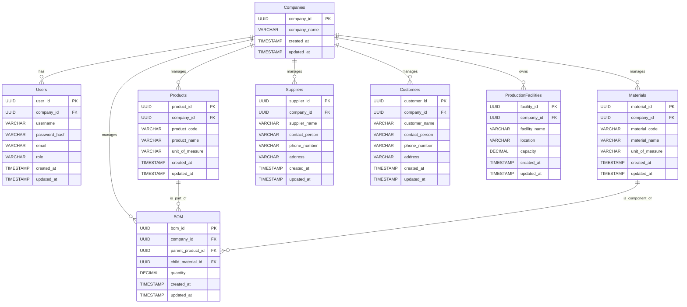

## 시스템 아키텍처 및 DB 설계 (WBS Task: E2E-01)

### 1. 오늘 Task에 대한 아키텍처 개요

본 WBS Task는 "전체 공통 아키텍처 수립"을 목표로 하며, 프로젝트 전반의 기술 기반이 될 핵심 요소들을 정의합니다. 구체적으로는 프로젝트 전반에 사용될 데이터베이스 스키마 설계, 주요 모듈 간 통신을 위한 API 엔드포인트 및 데이터 형식 정의, 소스 코드 관리를 위한 표준 디렉토리 구조 정의, 그리고 개발 환경 및 배포 전략 개요 수립을 포함합니다.

이 설계는 향후 각 모듈별 상세 개발을 위한 명확한 가이드라인을 제공하며, 일관성 있고 확장 가능한 시스템 구축의 초석이 됩니다.

### 2. 오늘 Task에 필요한 데이터베이스 스키마 (ERD 개념)

WBS Task의 'scope'에 따라, 프로젝트 전반에 사용될 핵심 엔티티 중심의 데이터베이스 스키마를 설계합니다. 이는 향후 각 모듈에서 공통적으로 참조하고 관리할 데이터의 구조를 정의합니다.

**핵심 엔티티:**

*   **`Companies` (기업 정보)**
    *   `company_id` (PK, UUID): 기업 고유 식별자
    *   `company_name` (VARCHAR): 기업명
    *   `created_at` (TIMESTAMP): 생성 일시
    *   `updated_at` (TIMESTAMP): 수정 일시

*   **`Users` (사용자 정보)**
    *   `user_id` (PK, UUID): 사용자 고유 식별자
    *   `company_id` (FK, UUID): 소속 기업 ID
    *   `username` (VARCHAR): 사용자명 (로그인 ID)
    *   `password_hash` (VARCHAR): 비밀번호 해시
    *   `email` (VARCHAR): 이메일 주소
    *   `role` (VARCHAR): 사용자 역할 (e.g., 'ADMIN', 'PLANNER', 'MANAGER')
    *   `created_at` (TIMESTAMP): 생성 일시
    *   `updated_at` (TIMESTAMP): 수정 일시

*   **`Products` (제품 정보)**
    *   `product_id` (PK, UUID): 제품 고유 식별자
    *   `company_id` (FK, UUID): 해당 제품을 관리하는 기업 ID
    *   `product_code` (VARCHAR): 제품 코드
    *   `product_name` (VARCHAR): 제품명
    *   `unit_of_measure` (VARCHAR): 측정 단위 (e.g., 'KG', 'EA')
    *   `created_at` (TIMESTAMP): 생성 일시
    *   `updated_at` (TIMESTAMP): 수정 일시

*   **`Materials` (원자재 정보)**
    *   `material_id` (PK, UUID): 원자재 고유 식별자
    *   `company_id` (FK, UUID): 해당 원자재를 관리하는 기업 ID
    *   `material_code` (VARCHAR): 원자재 코드
    *   `material_name` (VARCHAR): 원자재명
    *   `unit_of_measure` (VARCHAR): 측정 단위 (e.g., 'KG', 'L')
    *   `created_at` (TIMESTAMP): 생성 일시
    *   `updated_at` (TIMESTAMP): 수정 일시

*   **`Suppliers` (공급업체 정보)**
    *   `supplier_id` (PK, UUID): 공급업체 고유 식별자
    *   `company_id` (FK, UUID): 해당 공급업체를 관리하는 기업 ID
    *   `supplier_name` (VARCHAR): 공급업체명
    *   `contact_person` (VARCHAR): 담당자
    *   `phone_number` (VARCHAR): 전화번호
    *   `address` (VARCHAR): 주소
    *   `created_at` (TIMESTAMP): 생성 일시
    *   `updated_at` (TIMESTAMP): 수정 일시

*   **`Customers` (고객 정보)**
    *   `customer_id` (PK, UUID): 고객 고유 식별자
    *   `company_id` (FK, UUID): 해당 고객을 관리하는 기업 ID
    *   `customer_name` (VARCHAR): 고객명
    *   `contact_person` (VARCHAR): 담당자
    *   `phone_number` (VARCHAR): 전화번호
    *   `address` (VARCHAR): 주소
    *   `created_at` (TIMESTAMP): 생성 일시
    *   `updated_at` (TIMESTAMP): 수정 일시

*   **`BOM` (BOM 정보 - Bill of Materials)**
    *   `bom_id` (PK, UUID): BOM 고유 식별자
    *   `company_id` (FK, UUID): 해당 BOM을 관리하는 기업 ID
    *   `parent_product_id` (FK, UUID): 상위 제품 ID
    *   `child_material_id` (FK, UUID): 하위 원자재 ID
    *   `quantity` (DECIMAL): 하위 원자재의 필요량 (상위 제품 단위 기준)
    *   `created_at` (TIMESTAMP): 생성 일시
    *   `updated_at` (TIMESTAMP): 수정 일시

*   **`ProductionFacilities` (생산 시설 정보)**
    *   `facility_id` (PK, UUID): 생산 시설 고유 식별자
    *   `company_id` (FK, UUID): 해당 시설을 소유한 기업 ID
    *   `facility_name` (VARCHAR): 시설명
    *   `location` (VARCHAR): 위치
    *   `capacity` (DECIMAL): 생산 능력
    *   `created_at` (TIMESTAMP): 생성 일시
    *   `updated_at` (TIMESTAMP): 수정 일시

**ERD 개념:**



### 3. 시스템 컴포넌트 간 데이터 흐름도 설명

본 WBS Task는 전체 시스템의 기반을 다지는 단계이므로, 구체적인 모듈 간 데이터 흐름보다는 주요 컴포넌트(API Gateway, 서비스 모듈, 데이터베이스) 간의 일반적인 RESTful API 통신 방식을 설명합니다.

**주요 컴포넌트:**

*   **Client (Frontend/External Systems):** 사용자 인터페이스 또는 외부 시스템.
*   **API Gateway:** 모든 클라이언트 요청의 단일 진입점 역할을 하며, 라우팅, 인증, 로깅 등의 기능을 수행합니다.
*   **Service Modules (e.g., User Service, Product Service, Planning Service):** 각 기능별로 분리된 마이크로서비스 또는 모듈.
*   **Database:** 설계된 스키마에 따라 데이터를 저장하고 관리합니다.

**데이터 흐름:**

1.  **요청 (Request):**
    *   Client는 특정 기능을 수행하기 위해 API Gateway로 HTTP 요청(GET, POST, PUT, DELETE 등)을 보냅니다.
    *   요청에는 필요한 데이터(Payload)와 인증 정보(Token 등)가 포함될 수 있습니다.

2.  **API Gateway 처리:**
    *   API Gateway는 요청을 수신하고, 인증 및 권한 부여를 수행합니다.
    *   요청의 경로(Path)와 HTTP 메소드를 기반으로 적절한 Service Module로 요청을 라우팅합니다.

3.  **Service Module 처리:**
    *   라우팅된 Service Module은 요청을 수신합니다.
    *   필요한 경우, Service Module은 Database에 데이터를 조회하거나 저장하기 위해 데이터베이스 쿼리를 실행합니다.
    *   Service Module은 비즈니스 로직을 처리하고, 결과를 준비합니다.

4.  **데이터베이스 상호작용:**
    *   Service Module은 ORM(Object-Relational Mapper) 또는 직접적인 SQL 쿼리를 통해 Database와 통신합니다.
    *   데이터 조회, 삽입, 수정, 삭제 등의 작업을 수행합니다.

5.  **응답 (Response):**
    *   Service Module은 처리 결과를 JSON 또는 다른 형식의 응답 데이터로 생성합니다.
    *   이 응답 데이터는 API Gateway를 통해 Client에게 전달됩니다.
    *   API Gateway는 응답에 대한 추가적인 처리(로깅 등)를 수행할 수 있습니다.

**API 엔드포인트 및 데이터 형식 (RESTful 예시):**

*   **사용자 관리:**
    *   `POST /users`: 새 사용자 생성 (Request Body: `{ "username": "...", "email": "...", "password": "...", "role": "..." }`, Response Body: `{ "user_id": "...", "message": "User created successfully" }`)
    *   `GET /users/{user_id}`: 특정 사용자 정보 조회 (Response Body: `{ "user_id": "...", "username": "...", "email": "...", "role": "..." }`)
    *   `PUT /users/{user_id}`: 특정 사용자 정보 수정 (Request Body: `{ "role": "..." }`, Response Body: `{ "message": "User updated successfully" }`)
    *   `DELETE /users/{user_id}`: 특정 사용자 삭제 (Response Body: `{ "message": "User deleted successfully" }`)

*   **제품 관리:**
    *   `POST /products`: 새 제품 등록 (Request Body: `{ "product_code": "...", "product_name": "...", "unit_of_measure": "..." }`, Response Body: `{ "product_id": "...", "message": "Product created successfully" }`)
    *   `GET /products`: 모든 제품 목록 조회 (Response Body: `[ { "product_id": "...", "product_code": "...", ... }, ... ]`)
    *   `GET /products/{product_id}`: 특정 제품 상세 조회 (Response Body: `{ "product_id": "...", "product_code": "...", ... }`)

*   **BOM 관리:**
    *   `POST /boms`: BOM 정보 등록 (Request Body: `{ "parent_product_id": "...", "child_material_id": "...", "quantity": ... }`, Response Body: `{ "bom_id": "...", "message": "BOM created successfully" }`)
    *   `GET /products/{product_id}/boms`: 특정 제품의 BOM 목록 조회 (Response Body: `[ { "bom_id": "...", "material_name": "...", "quantity": ... }, ... ]`)

이러한 API 엔드포인트는 각 Service Module에서 구현될 것이며, 데이터 형식은 JSON을 기본으로 합니다.

**표준 디렉토리 구조 (예시):**

```
/project-root
├── /api-gateway           # API Gateway 설정 및 코드
├── /services              # 각 서비스 모듈 디렉토리
│   ├── /user-service      # 사용자 관련 서비스
│   │   ├── /src
│   │   │   ├── /controllers
│   │   │   ├── /services
│   │   │   ├── /models      # DB 모델 정의
│   │   │   └── /routes
│   │   ├── package.json
│   │   └── Dockerfile
│   ├── /product-service   # 제품 관련 서비스
│   │   ├── ...
│   └── /planning-service  # 계획 관련 서비스 (향후 구현)
│       ├── ...
├── /common                # 공통 라이브러리 및 유틸리티
│   ├── /utils             # 유틸리티 함수
│   └── /constants         # 공통 상수
├── /config                # 환경 설정 파일
│   ├── /development
│   └── /production
├── Dockerfile             # 전체 애플리케이션 Dockerfile
├── docker-compose.yml     # Docker Compose 설정
├── README.md
└── .gitignore
```

**개발 환경 및 배포 전략 개요:**

*   **개발 환경:**
    *   컨테이너화: Docker를 사용하여 개발 환경을 표준화하고 격리합니다.
    *   로컬 개발: Docker Compose를 활용하여 API Gateway, 각 Service Module, Database를 로컬에서 실행합니다.
    *   언어/프레임워크: Node.js (Express/NestJS), Python (Flask/Django), Java (Spring Boot) 등 프로젝트 특성에 맞는 기술 스택을 선택합니다.
    *   데이터베이스: PostgreSQL 또는 MySQL과 같은 관계형 데이터베이스를 사용합니다.
*   **배포 전략:**
    *   CI/CD 파이프라인 구축: Jenkins, GitLab CI, GitHub Actions 등을 활용하여 코드 빌드, 테스트, 배포 자동화.
    *   컨테이너 오케스트레이션: Kubernetes 또는 Docker Swarm을 사용하여 서비스의 배포, 확장, 관리를 자동화합니다.
    *   클라우드 환경: AWS, Azure, GCP 등 클라우드 플랫폼을 활용하여 인프라를 구축하고 관리합니다.
    *   점진적 배포: Canary Release, Blue-Green Deployment 등의 전략을 통해 서비스 안정성을 확보합니다.